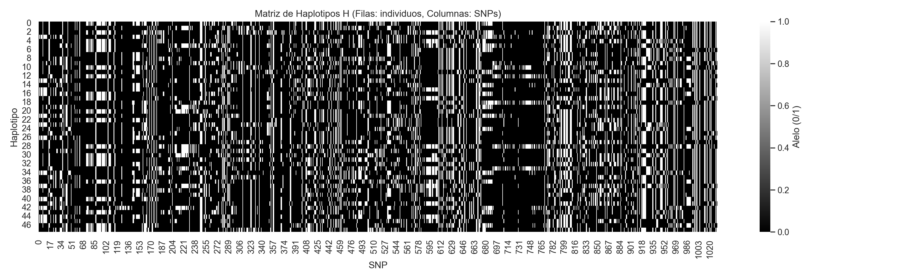
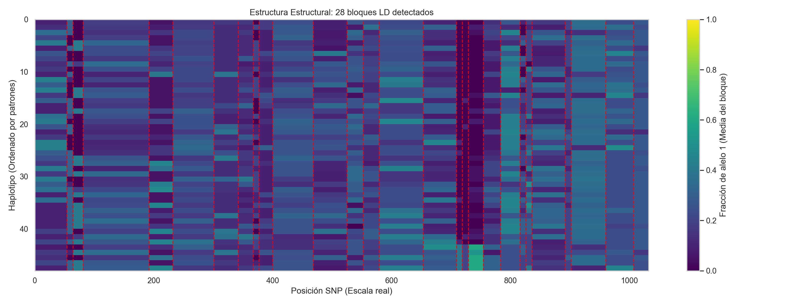
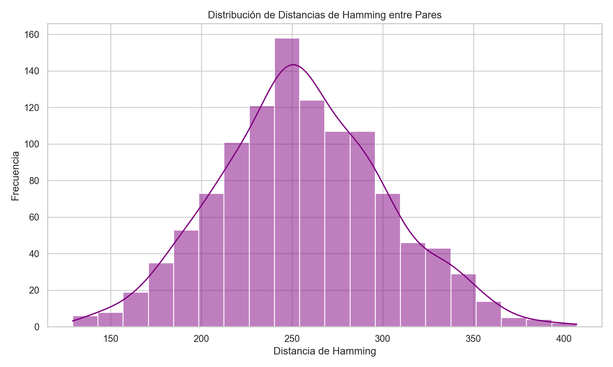
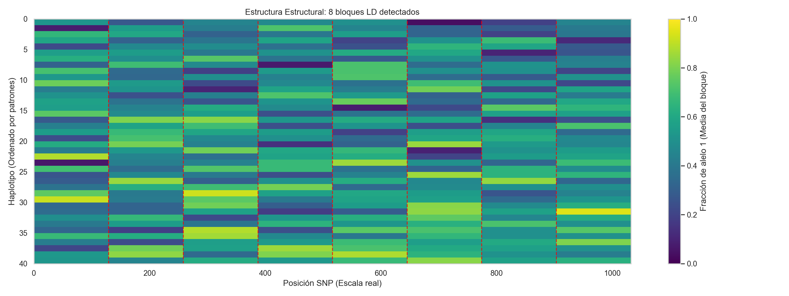
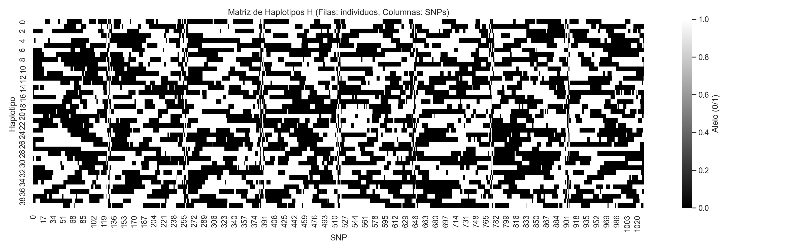
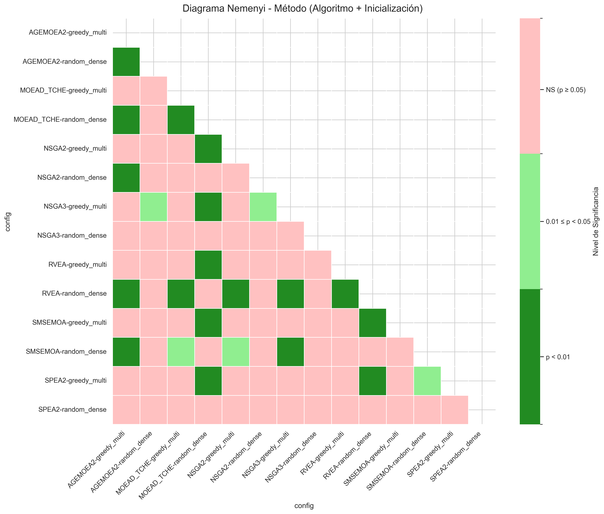
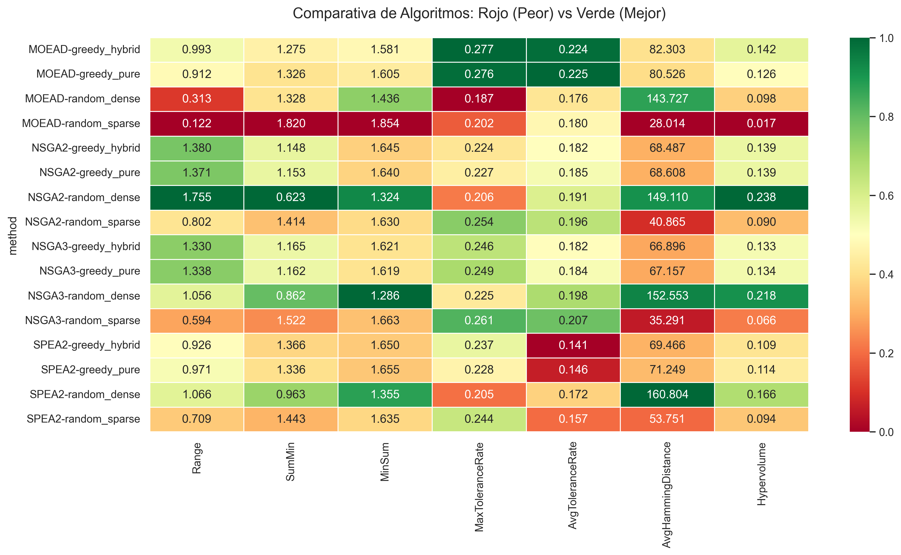
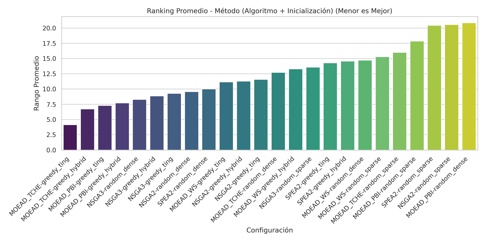
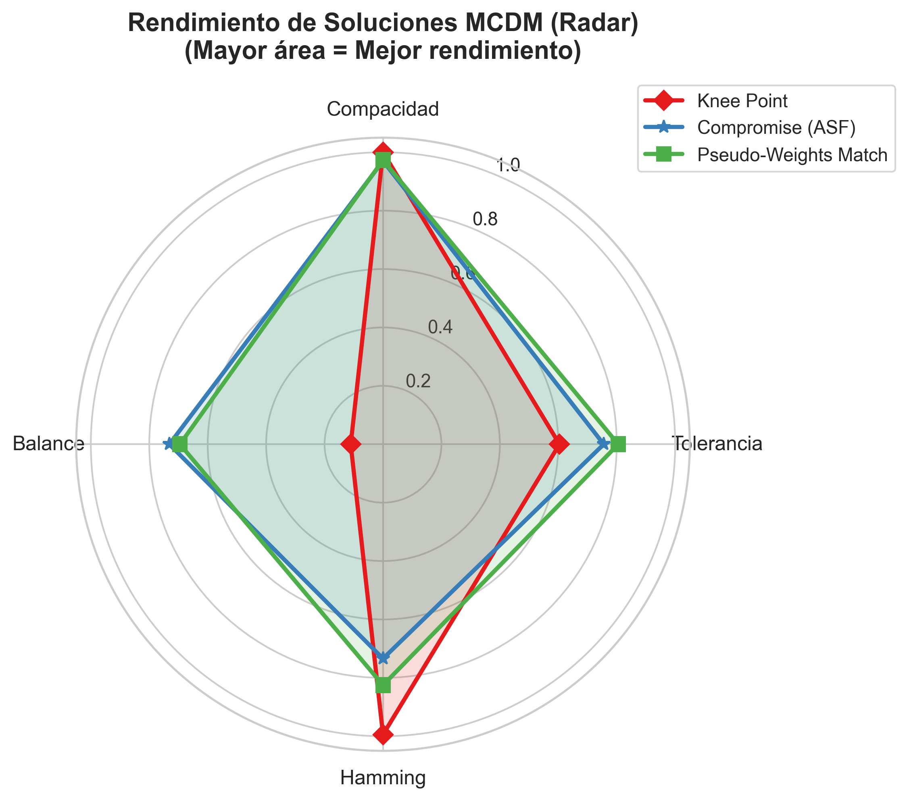

# Optimización Multiobjetivo para la Selección de Tag SNPs

Este repositorio contiene la implementación de un pipeline modular basado en algoritmos evolutivos multiobjetivo (MOEAs) diseñado para resolver el problema de selección de **Tag SNPs**. El sistema permite identificar conjuntos reducidos de polimorfismos de nucleótido único (SNPs) que preservan la variabilidad genética necesaria para estudios de asociación genómica, equilibrando la eficiencia computacional con la precisión biológica.

## Índice

1. **[Introducción](#sección-1-introducción)**
   * Contexto académico del problema.
   * Enfoque evolutivo multiobjetivo.
2. **[Marco Experimental](#sección-2-marco-experimental)**
   * Datasets (Hinds et al. y Sintéticos).
   * Preprocesamiento de Datos (Filtrado de SNPs).
   * Suite de diagnóstico y caracterización de datos.
   * Objetivos de optimización
   * Algoritmos e Inicializaciones
   * Parámetros configurables.
3. **[Ejecución y Estructura del Proyecto](#sección-3-ejecución-y-estructura-del-proyecto)**
   * Dependencias e Instalación.
   * Interfaz de Línea de Comandos (CLI).
   * Estructura y arquitectura del código.
4. **[Profundizamiento de Algoritmos y Motor Evolutivo](#sección-4-profundizamiento-de-algoritmos-y-motor-evolutivo)**
   * Implementación y Operadores de Variación.
   * Direcciones de Referencia (Das-Dennis).
   * Operador de Reparación (ReparaciónSNP).
   * Motor de Paralelización y Gestión de Recursos.
   * Gestión de Escalas y Normalización.
5. **[Validación Estadística Rigurosa](#sección-5-validación-estadística-rigurosa)**
   * Test de Friedman y Kruskal-Wallis.
   * Análisis Post-hoc (Nemenyi y Dunn).
6. **[Diccionario de Métricas Técnicas y Supra-métricas](#sección-6-diccionario-de-métricas-técnicas-y-supra-métricas)**
   * Métricas de Rendimiento Analizadas
   * La Supra-métrica Analítica: Average Rank.
7. **[Multi-Criteria Decision Making (MCDM)](#sección-7-multi-criteria-decision-making-mcdm)**
   * Criterios de Selección Técnica
   * Visualización de Decisiones

---

## Sección 1: Introducción

### Contexto Académico del Tag SNP Selection Problem (TSSP)

El mapeo de variantes genéticas responsables de enfermedades complejas se basa frecuentemente en estudios de asociación de genoma completo (**GWAS**). Sin embargo, la densidad de SNPs en el genoma humano y el fenómeno del **Desequilibrio de Ligamiento (LD)** —la asociación no aleatoria de alelos en diferentes loci— generan una redundancia masiva de información. 

El problema de selección de **Tag SNPs** (TSSP) consiste en seleccionar un subconjunto mínimo de SNPs (los "Tags") que puedan representar o "etiquetar" al resto de variantes con una pérdida mínima de información. La resolución óptima de este problema es crucial para reducir los costes de genotipado sin sacrificar el poder estadístico de los estudios genéticos.

### Enfoque Evolutivo Multiobjetivo

Dada la naturaleza combinatoria y la presencia de objetivos en conflicto (como minimizar el número de SNPs frente a maximizar la representatividad), este proyecto aborda el TSSP mediante un marco de **Optimización Multiobjetivo**. 

En lugar de colapsar las métricas en una única función de aptitud, se emplean algoritmos evolutivos para explorar el **Frente de Pareto**. Este enfoque permite obtener una colección de soluciones óptimas que ofrecen diferentes compromisos (*trade-offs*) entre:

* **Compacidad**: Minimización del número de marcadores seleccionados.
* **Tolerancia**: Maximización de la robustez frente a la pérdida de datos.
* **Distancia Hamming**: Maximización de la diversidad representativa.
* **Disimilitud**: Optimización del equilibrio (balance de varianza) entre marcadores.

---

## Sección 2: Marco Experimental

Esta sección describe los componentes fundamentales del entorno de experimentación, incluyendo la naturaleza de los datos, las métricas de optimización y la configuración del motor evolutivo.

### Datos

El pipeline está diseñado para operar sobre estructuras genómicas complejas, validando su eficacia tanto en entornos biológicos reales como en simulaciones controladas.

#### Hinds et al. (2005) - Benchmark Real

Este dataset, extraído de los estudios de Perlegen Sciences, representa el estándar de oro en la literatura de Tag SNPs. Consta de **1032 SNPs** y **48 haplotipos**, caracterizándose por una arquitectura genética altamente estructurada.

> En la ejecución de referencia (`20260418T174114`), el sistema detectó una estructura de **28 bloques de ligamiento** con una correlación media absoluta (|r|) de **0.0776**.


*Figura 1: Representación matricial de los haplotipos (0/1) del dataset de Hinds et al. (2005).*


*Figura 2: Visualización de los 28 bloques de ligamiento detectados en el dataset de Hinds et al. (2005).*

El análisis de similitud genotípica revela una diversidad equilibrada, con distancias de Hamming que oscilan entre el percentil 33 (P33=237.0) y el percentil 66 (P66=273.0), permitiendo evaluar la capacidad de los algoritmos para preservar variaciones sutiles.


*Figura 3: Histograma de distancias de Hamming, reflejando la complejidad de la variación inter-haplotípica.*

##### Procedencia y Adquisición

La obtención del dataset de Hinds et al. (2005) fue un proceso de "arqueología de datos" para asegurar la replicación exacta de los experimentos de Moqa et al. (2022):

1. **Identificación de la Fuente Original**: El artículo de Moqa et al. (2022) cita el dataset original, pero la metodología específica de uso del bloque de 1032 SNPs proviene de Ting et al. (2010), el artículo precursor.
2. **Rastreo del Artículo de Ting (2010)**: Se localizó el software y los datos originales depositados en el sitio web del laboratorio de los autores en la Universidad Nacional Chung Cheng (CCU) de Taiwán.
3. **Localización y Descarga**: Se accedió a un servidor activo (`cilab.cs.ccu.edu.tw`) que contenía el archivo `Code_MoTagSNPsSel.zip`. Dentro de este paquete se recuperó el fichero `input.txt`.
4. **Verificación de los Datos**: Se confirmó que el fichero cumplía con las especificaciones exactas: 48 filas por 1032 columnas en formato de texto binario plano, validado explícitamente por el README de Ting como el bloque utilizado en los estudios de referencia.
5. **Integración en el Proyecto**: Los datos se integran como `snp_tag/data/datasets/hinds2005_1032.txt`, y se cargan mediante `cargar_bloque_hinds2005`, que interpreta este formato binario (diferente de estándares HapMap).

En resumen, el dataset no fue descargado de una base de datos genómica general, sino directamente del **paquete de replicación oficial** de los autores originales, garantizando la integridad absoluta de las comparativas de *benchmarking*.

#### Datasets Sintéticos - Simulación de Bloques LD

Los datos sintéticos se generan mediante un modelo estocástico avanzado diseñado para evaluar la robustez y escalabilidad de los algoritmos bajo condiciones controladas. El motor de generación ha sido actualizado para simular una arquitectura genética más realista:

* **Modelo de Cadena LD**: Los SNPs se generan secuencialmente siguiendo un modelo de cadena acumulativa. Cada marcador se deriva de su predecesor con una probabilidad de inversión (*flip*) que garantiza una correlación de ligamiento coherente.
* **Zonas de Transición Gradual**: Se han implementado regiones de transición entre bloques de ligamiento. En estas zonas, la probabilidad de mutación se interpola suavemente hacia 0.5, simulando los puntos de recombinación biológica donde el ligamiento decae.
* **Diversidad Garantizada**: El sistema aplica un proceso iterativo de "reparación de diversidad" para asegurar que la distancia genotípica entre cualquier par de haplotipos supere un umbral mínimo (`dif_min_pares_sintetico`), evitando poblaciones genéticamente redundantes.

Esta flexibilidad se gestiona a través de los parámetros en `user_config.ini`:

* `n_snps` / `n_haplotipos`: Dimensiones de la matriz.
* `tam_bloque_sintetico`: Tamaño promedio de los bloques de ligamiento.
* `prob_flip_sintetico`: Probabilidad base de mutación intra-bloque.
* `ancho_transicion`: Anchura de la zona de recombinación entre bloques.
* `dif_min_pares_sintetico`: Distancia Hamming mínima exigida entre pares.


*Figura 5: Visualización de los bloques de ligamiento y la matriz de haplotipos generada estocásticamente con el nuevo modelo.*


*Figura 6: Mapa de calor de la estructura haplotípica sintética, donde se observa la coherencia estructural inducida por el modelo de cadenas LD.*

### Preprocesamiento de Datos

Antes de cualquier análisis o búsqueda evolutiva, el sistema realiza un filtrado automático de la matriz haplotípica para asegurar la calidad de la entrada:

* **Filtrado de SNPs Monomórficos**: Se eliminan todos los loci que no presentan variación alélica (es decir, aquellos donde todos los individuos tienen el mismo alelo, ya sea 0 o 1). 
* **Criterio de Inclusión**: Un SNP se conserva si y solo si cumple la condición $0 < \sum(\text{columna}) < N_{\text{haplotipos}}$.
* **Justificación**: Los SNPs monomórficos no aportan información para distinguir entre haplotipos y actúan como ruido computacional, inflando el espacio de búsqueda sin ofrecer beneficios biológicos para la selección de Tags. El sistema reporta automáticamente el número de SNPs útiles tras esta fase (ej. 772 de los 1032 originales en Hinds).

### Suite de Diagnóstico y Caracterización

Antes de iniciar la búsqueda evolutiva, el sistema ejecuta un diagnóstico exhaustivo para caracterizar la arquitectura del conjunto de datos. Este análisis preliminar permite comprender la complejidad del espacio de búsqueda y validar la integridad biológica de las entradas.

#### Dimensiones del Análisis:

* **Estructura de Haplotipos e LD**: Visualización de patrones alélicos y detección automatizada de bloques de ligamiento basados en "hotspots" de recombinación.
* **Variabilidad y Frecuencia**: Estudio de la distribución de frecuencias alélicas y variabilidad por SNP, incluyendo el análisis de alelos dominantes.
* **Desequilibrio de Ligamiento (LD)**: Cálculo de la correlación media absoluta global ($|r|$) y generación de matrices de correlación completa con sus respectivas distribuciones estadísticas (CDF).
* **Similitud Genotípica**: Caracterización de la diversidad inter-haplotípica mediante distancias de Hamming, identificando pares de individuos con extrema similitud o divergencia funcional.

Esta fase genera un reporte detallado en la terminal y un conjunto de visualizaciones en la carpeta de resultados (subdirectorio `0_datos_previos`), proporcionando una "huella digital" del dataset antes de proceder con el motor evolutivo.

<details>
<summary><b>Ver ejemplo de salida de terminal (Diagnóstico)</b></summary>

```text
╔══════════════════════════════════════════════════════════════════════════════╗
║                  DIAGNÓSTICO DE DATOS Y DESEQUILIBRIO (LD)                   ║
╚══════════════════════════════════════════════════════════════════════════════╝

  🧬 Visualización de la Estructura de Haplotipos
  ──────────────────────────────────────────────────
      🖼️  Mapa de calor de haplotipos: heatmap_haplotipos_full.png
      🖼️  Estructura LD (28 bloques): bloques_ld_haplotipos_full.png

  📈 Análisis de Variabilidad y Frecuencia Alélica
  ───────────────────────────────────────────────────
      🖼️  Distribución de frecuencia alélica: histograma_alelico_full.png
      🖼️  Variabilidad por SNP: variabilidad_snps_full.png
      🖼️  Alelos dominantes por haplotipo: conteo_alelos_full.png
      🖼️  Distribución de distancias de Hamming: histograma_hamming_full.png

  🔗 Caracterización Global de Correlación (LD)
  ──────────────────────────────────────────────
      • Correlación media absoluta (global |r|): 0.0776
      • Total de pares evaluados: 531996
      🖼️  Mapa de calor de correlación (LD): heatmap_correlacion_completa_full.png
      🖼️  Distribución de correlaciones (LD): histograma_correlaciones_ld_full.png
      🖼️  CDF de correlación LD: cdf_correlacion_absoluta_ld_full.png

  📜 Resumen Estructural del Dataset
  ───────────────────────────────────
      • Estructura detectada: 28 bloques de ligamiento
      • Correlación media absoluta (|r|): 0.0776
      • Naturaleza del dato: Benchmark biológico (Hinds)

  📐 Análisis de Similitud Genotípica (Pares de Haplotipos)
  ──────────────────────────────────────────────────────────
      • Número de pares de haplotipos: 1128
      • Pares mostrados: 3 similares / 3 distintos
      • Vista parcial: primeros 32 SNPs
      • Percentiles (Hamming): P33=237.00, P66=273.00
      • [Etiquetas: <=P33 -> muy similar | (P33,P66] -> intermedio | >P66 -> muy distinto]

    🤝 Pares de mayor similitud genética
      •  Par (26, 27) | Hamming=129 | muy similar
        h026: 00000000000000100111100000000000...
        h027: 01011101111110000010011000000...
      •  Par (17, 41) | Hamming=134 | muy similar
        h017: 01011101111110000010011000000...
        h041: 01011101111110000010011000000...
      •  Par (36, 46) | Hamming=140 | muy similar
        h036: 00000000000000100111101001100000...
        h046: 01011101111110000010011000000...

    ↔️ Pares de mayor divergencia genética
      •  Par (29, 36) | Hamming=407 | muy distinto
        h029: 00000010000000011000000000000000...
        h036: 00000000000000100111101001100000...
      •  Par (28, 29) | Hamming=404 | muy distinto
        h028: 00000010000000011000000000000000...
        h029: 00000010000000011000000000000000...
      •  Par (24, 29) | Hamming=390 | muy distinto
        h024: 01011101111110000010011000000...
        h029: 00000010000000011000000000000000...
```

</details>

### Objetivos de Optimización

El motor evolutivo busca optimizar simultáneamente cuatro dimensiones críticas:

1. **Compacidad**: Minimización del número de SNPs seleccionados. El objetivo es encontrar el conjunto representativo más pequeño posible.
2. **Tolerancia**: Maximización de la robustez ante datos perdidos. Evalúa la capacidad del conjunto de Tag SNPs para mantener la representatividad en presencia de errores de lectura.
3. **Distancia Hamming**: Maximización de la diversidad representativa. Busca maximizar la distancia genética promedio para asegurar que los Tags cubran el espacio de variabilidad del dataset.
4. **Disimilitud (Balance de Varianza)**: Optimización del equilibrio entre marcadores. Se centra en balancear la información proporcionada por cada SNP seleccionado para evitar redundancias internas.

#### Evaluación de Fitness (`modo_evaluacion`)

El motor permite alterar la naturaleza matemática de las funciones objetivo a través del parámetro de evaluación. La configuración más avanzada es `modo_evaluacion=proportional`.

En este modo, las métricas biológicas se calculan de forma **proporcional** a la compacidad (tamaño $k$) de la solución. Además, se introduce el parámetro `cap_tolerancia` para acotar la recompensa por redundancia excesiva, evitando que soluciones sobredimensionadas dominen el frente por pura fuerza bruta.

> **Nota sobre decodificación real**: Al evaluar en modo proporcional, el sistema escala de forma inversa la cobertura mínima y el promedio de Hamming real por la fracción de SNPs activos para preservar la interpretabilidad biológica de los resultados físicos del panel.

Las fórmulas resultantes para los objetivos en modo proporcional son:

* **Tolerancia Proporcional ($f_2^{prop}$):** 
  $$f_2^{prop} = \frac{\min(\text{cobertura mínima}, \text{cap tolerancia})}{k}$$
* **Distancia Hamming Proporcional ($f_3^{prop}$):** 
  $$f_3^{prop} = - \left( \frac{\sum_{i=1}^{N_{pares}} H_i}{N_{pares} \cdot k} \right)$$
* **Disimilitud Proporcional ($f_4^{prop}$):**
  $$f_4^{prop} = \frac{\sigma^{2}(H)}{k^2}$$

*Donde $k$ es el número de SNPs seleccionados, $H_i$ la distancia de Hamming del par $i$, $N_{pares}$ el número total de pares de haplotipos y $\sigma^2(H)$ la varianza de las distancias.*

### Algoritmos e Inicializaciones

El sistema implementa un entorno comparativo que evalúa la sinergia entre diferentes algoritmos y estrategias de población inicial:

* **Algoritmos Soportados**:
  
  * **NSGA-II / NSGA-III**: Algoritmos de ordenación no dominada (estándar y para many-objective).
  * **SPEA2**: Strength Pareto Evolutionary Algorithm 2.
  * **MOEA/D (TCHE, PBI, WS)**: Variantes basadas en descomposición.
  * **AGE-MOEA-II**: Especializado en aproximación adaptativa de la geometría del frente.
  * **SMS-EMOA**: Optimización basada en la métrica S (Hipervolumen).
  * **RVEA**: Reference Vector Guided Evolutionary Algorithm.
  
  La selección final de algoritmos a ejecutar es totalmente configurable mediante la lista tunable `algoritmos_activos`.

* **Estrategias de Inicialización**:
  
  * `random_dense`: Muestreo aleatorio estándar (probabilidad 0.5 por bit). Ideal para evaluar la capacidad de "poda" de los algoritmos.
  * `greedy_multi`: Inicialización de **cobertura múltiple progresiva**. Distribuye objetivos de redundancia biológica en la población para asegurar que el frente de Pareto esté poblado desde el inicio con soluciones robustas.
  * `greedy_holistic`: La estrategia más avanzada del sistema. Utiliza un enfoque de **5 niveles (Tiers)**:
    1. **Anclas de Pareto**: Extremos teóricos de cada objetivo.
    2. **Barrido k-Cover**: Cobertura progresiva con espaciado geométrico.
    3. **Ensamblaje por Bloques LD**: Diversidad estructural basada en ligamiento real.
    4. **Inyección de Complementos**: Soluciones que "parchean" debilidades de individuos existentes.
    5. **Exploración Guiada Dispersa**: Muestreo ponderado por importancia de SNP.
  * `greedy_ting`: Algoritmo complejo de construcción jerárquica basado en puntos ancla y bloques.

##### Detalle Técnico de las Estrategias de Muestreo

Para optimizar la búsqueda en el espacio binario, el motor de inicialización implementado en `snp_tag/core/sampling.py` utiliza las siguientes mecánicas avanzadas:

* **Priorización por Distinguibilidad**: Los SNPs no se eligen al azar en las estrategias constructivas; se ordenan matemáticamente según su capacidad para discriminar entre clases alélicas.
* **Desempate Estocástico**: Ante SNPs con idéntico valor funcional, el sistema introduce permutaciones aleatorias para asegurar que los individuos constructivos no sean genéticamente clónicos, protegiendo la varianza inicial de la población.

### Parámetros Configurables

El sistema permite un ajuste fino a través de perfiles predefinidos (`presets`) y parámetros específicos en `user_config.ini`:

* **Presets de Ejecución**:
  * `fast`: Ejecuciones rápidas para validación de flujo (población y generaciones mínimas).
  * `medium`: Configuración estándar para experimentos académicos equilibrados.
  * `high`: Configuración intermedia orientada a explorar más que `medium` con un coste computacional moderado.
  * `full`: Búsqueda exhaustiva diseñada para obtener el frente de Pareto más preciso.
  * `full_20`: Idéntico a `full` pero elevando el número de repeticiones a **20 ejecuciones por método**, diseñado para análisis de significancia estadística profunda.
* **Parámetros Tunables**: Incluyen probabilidades de cruce (`pc`), mutación (`pm`), lista de algoritmos activos (`algoritmos_activos`), operadores de cruce (`crossover_operadores_activos`: UX, HUX, 1P, 2P), modo de semillas, transformación de objetivos, y los nuevos parámetros de control:
  * `cap_tolerancia`: Tope máximo de recompensa por cobertura de pares (ej. 3.0).
  * `max_cobertura_objetivo`: Nivel de redundancia para `greedy_multi`.
  * `max_k_holistic`: Nivel de redundancia para el Tier 2 de `greedy_holistic`.
  * `ratio_greedy_ting`: Proporción de individuos heurísticos en la estrategia Ting.

Formato recomendado en `user_config.ini`:

```text
[Seccion]
clave = valor ; explicación
```

Ejemplo (extracto corto) de `user_config.ini`:

```ini
[General]
dir_salida_base = results ; Directorio raíz de salida de resultados

[Dataset]
n_snps = 1032 ; Número total de SNPs del bloque objetivo
num_bloques = 8 ; Número de bloques LD en los que se divide la secuencia sintética
prob_flip_sintetico = 0.03 ; Probabilidad de flip por SNP al generar datos sintéticos
dif_min_pares_sintetico = 100 ; Distancia Hamming mínima objetivo entre pares sintéticos
intentos_max_sintetico = 1000 ; Intentos máximos para forzar la distancia mínima sintética

[Objetivos]
modo_transformacion_objetivos = neg ; (neg o inverse)
modo_evaluacion = proportional ; (absoluta o proportional)

[Algoritmos]
semilla_maestra = 42 ; Semilla maestra
modo_semillas = non_deterministic ; (non_deterministic o deterministic)
pc = 0.7 ; Probabilidad de cruce
algoritmos_activos = NSGA2, NSGA3, SPEA2, MOEAD_TCHE, MOEAD_PBI, MOEAD_WS
opciones_init = random_sparse, random_dense, greedy_pure, greedy_hybrid

[Normalización]
modo_normalizacion = static_proportional_limits ; (per_algorithm, global_all_pairs, static_dataset_limits, static_proportional_limits)

[Reporting]
report_plot_dpi = 300 ; DPI de las figuras
paso_generacional_metricas = 10 ; Calcular métricas cada N generaciones (0 para deshabilitar)
```

<details>
<summary><b>Ver ejemplo de reporte de configuración y metadatos</b></summary>

```text
  ⚙ CONFIGURACIÓN
  ───────────────────
      • Modo=full | POP_SIZE=200 | N_GEN=500 | OFFSPRING=200 | PC=0.7 | PM=0.000969 | N_RUNS=5

  📊️ Metadatos y Dimensiones del Dataset
  ─────────────────────────────────────────
    ✅ Hinds 2005 cargado y filtrado: 48 patrones alelicos × [N_polimórficos] SNPs polimórficos (de 1032 originales)
    • ORIGEN_DATOS=hinds2005 (Hinds et al. 2005 / Perlegen) | N_SNPS=[N_polimórficos] | N_PATRONES=48 | PM=1/N_polimórficos
    • FICHERO=snp_tag/data/datasets/hinds2005_1032.txt
    • REPORT_DPI=300 | NORMALIZATION_MODE=static_dataset_limits | SEED_MODE=non_deterministic | OBJ_TRANSFORM=neg
      • REPORT_DPI=300 | NORMALIZATION_MODE=static_dataset_limits
```

</details>

---

## Sección 3: Ejecución y Estructura del Proyecto

Esta sección proporciona las instrucciones necesarias para configurar el entorno y ejecutar el pipeline de selección de Tag SNPs.

### Dependencias e Instalación

El proyecto está desarrollado en **Python 3.8+** y requiere las siguientes librerías científicas para el procesamiento de datos, optimización y visualización:

* **pymoo**: Marco de trabajo principal para la optimización multiobjetivo.
* **pandas**: Gestión y análisis de datos en formato tabular (CSVs y métricas).
* **numpy**: Operaciones numéricas y manipulación de matrices genotípicas.
* **matplotlib**: Motor base de generación de gráficos.
* **seaborn**: Visualizaciones estadísticas avanzadas (mapas de calor, boxplots, violines).
* **scipy**: Funciones estadísticas (p. ej., CDF y tests).
* **statsmodels**: Soporte estadístico adicional para visualizaciones/análisis.
* **scikit-posthocs** *(opcional)*: Post-hoc de Nemenyi (si no está instalado, el análisis se omite).

Para asegurar que todas las dependencias están instaladas, puede utilizar el siguiente comando:

```bash
pip install -r requirements.txt
```

### Interfaz de Línea de Comandos (CLI)

El sistema se ejecuta como un paquete modular a través de su punto de entrada unificado. La ejecución se puede personalizar mediante argumentos de línea de comandos:

```bash
python -m snp_tag --mode [MODO] --data-source [FUENTE] [--report-only-csv]
```

**Argumentos Disponibles:**

* `--mode` (`-m`): Define el preset de ejecución configurado en `snp_tag/config.py`.
  * `fast`: Validación rápida (pocos individuos/generaciones).
  * `medium`: Experimento estándar académico (recomendado).
  * `high`: Perfil intermedio entre `medium` y `full`.
  * `full`: Búsqueda exhaustiva de alta precisión para el frente de Pareto.
  * `full_20`: Búsqueda exhaustiva con 20 réplicas por configuración para robustez estadística.
  * `full_30`: Búsqueda exhaustiva con 30 réplicas independientes para validación de datos.
* `--data-source` (`-d`): Especifica el dataset objetivo.
  * `hinds2005`: Utiliza el dataset biológico real de Hinds et al. (1032 SNPs).
  * `synthetic`: Genera un dataset sintético basado en los parámetros de simulación.
* `--report-only-csv`: Activa el modo de generación exclusiva de reportes a partir de archivos CSV existentes en el directorio `snp_tag/input/`.
* **Interfaz de Línea de Comandos (CLI)**: El sistema ofrece un dashboard dinámico en terminal que reporta el progreso en tiempo real. Además, utiliza secuencias **OSC 8** para generar hipervínculos clicables directamente en la terminal, permitiendo abrir los reportes CSV y figuras PDF de forma instantánea al finalizar el experimento.

### Estructura del Código

El paquete `snp_tag` está organizado de forma modular para facilitar su mantenimiento y extensión:

* **`core/`**: Definiciones fundamentales del problema de optimización (clase `TSSPProblem`), envolturas de algoritmos y estrategias de muestreo inicial.
* **`data/`**: Gestión de datasets (`loader.py`). Contiene los benchmarks biológicos.
* **`engine/`**: Núcleo de la lógica de procesamiento y evaluación del motor evolutivo (`diagnostics_logic.py`, `mcdm_logic.py`, `metrics_logic.py`, `stats_logic.py`).
* **`visualization/`**: Módulos dedicados exclusivamente a la generación de visualizaciones de cada componente (`convergence_plot.py`, `diagnostics_plot.py`, `fronts_plot.py`, `mcdm_plot.py`, `stats_plot.py`).
* **`pipelines/`**: Contiene los flujos de ejecución específicos del ciclo de vida del experimento (ej. de reporte, ejecución evolutiva).
* **`utils/`**: Funciones auxiliares para la gestión del sistema de archivos, entorno, logs (`logger.py`) y terminal.
* **`__main__.py`**: Punto de entrada modular de la aplicación (`python -m snp_tag`).
* **`orchestrator.py`**: Componente central encargado de orquestar y coordinar los diferentes pipelines de ejecución.
* **`constants.py`**: Centralización de constantes estructurales y variables del proyecto.
* **`config.py`**: Parámetros globales y estados del entorno de simulación.

Fuera del paquete principal, el repositorio gestiona la automatización y la persistencia de resultados históricos:

* **`automation/`**: Scripts y configuraciones para la ejecución desatendida y remota de experimentos de larga duración.
* **`ejecuciones_guardadas/`**: Almacén jerárquico de experimentos. Se organiza por fechas y contiene los datos brutos (`experimentos/`), visualizaciones de alta resolución y los **reportes técnicos en LaTeX** (`analisis/`) que generan la documentación final del TFG en formato PDF.

---

## Sección 4: Profundizamiento de Algoritmos y Motor Evolutivo

Esta sección describe la arquitectura técnica del motor de optimización, detallando la implementación de los algoritmos y las estrategias para maximizar el rendimiento computacional.

### Implementación y Operadores de Variación

El pipeline utiliza el marco de trabajo **PyMoo** para instanciar algoritmos de optimización multiobjetivo de vanguardia. La efectividad de la búsqueda en el espacio binario de los SNPs se apoya en operadores de variación específicamente seleccionados:

* **Operadores de Cruce (Crossover)**: El sistema soporta múltiples estrategias de recombinación configurables ($P_c = 0.7$):
  * **Uniform Crossover (UX)**: Intercambio de alelos bit a bit con probabilidad 0.5. Es ideal para el TSSP ya que permite una exploración flexible sin asumir que la proximidad física en el genoma implica una relación funcional absoluta.
  * **Half Uniform Crossover (HUX)**: Cruce de "barajado" que identifica los bits diferentes entre padres e intercambia exactamente la mitad de ellos. Maximiza la diversidad genética en la descendencia.
  * **Single Point (1P) / Two Point (2P)**: Operadores clásicos de corte que preservan segmentos contiguos de SNPs. Son útiles para mantener bloques de ligamiento (LD) completos si la estructura del dataset es muy secuencial.
* **Bitflip Mutation**: La probabilidad de mutación se calibra dinámicamente siguiendo la heurística $P_m = 1/N_{vars}$. Para el bloque de Hinds (1032 SNPs), esto resulta en $P_m \approx 0.000969$, asegurando que, estadísticamente, se explore un cambio de marcador por cada individuo en cada generación, manteniendo la estabilidad de las soluciones de alta calidad.

### Direcciones de Referencia (Das-Dennis)

Para algoritmos basados en descomposición o preservación de la diversidad (como **NSGA-III** y **MOEA/D**), el sistema genera un conjunto de direcciones de referencia que guían la búsqueda de forma uniforme sobre el hiperplano de los objetivos.

El motor utiliza el método de **Das-Dennis** para distribuir puntos de referencia sobre el frente de Pareto de 4 dimensiones. El número de particiones se ajusta automáticamente en función del tamaño de población configurado para garantizar una cobertura densa y balanceada de todas las regiones de compromiso (*trade-offs*).

### Operador de Reparación (ReparaciónSNP)

Para garantizar la integridad del proceso evolutivo y evitar soluciones degeneradas, el sistema implementa un **Operador de Reparación** personalizado. Este operador actúa inmediatamente después de las fases de cruce y mutación:

* **Detección de Individuos Vacíos**: Intercepta cualquier solución que, tras la variación genética, haya quedado con cero SNPs seleccionados ($k=0$).
* **Activación Aleatoria**: En caso de detectar un individuo vacío, el operador activa automáticamente un SNP aleatorio de la secuencia genómica.
* **Propósito**: Esta mecánica asegura que cada individuo en la población represente un fenotipo válido con al menos una mínima representación biológica. Además, previene errores matemáticos (divisiones por cero) en el cálculo de métricas proporcionales y mantiene la presión selectiva sobre soluciones factibles.

### Motor de Paralelización y Gestión de Recursos

Dada la naturaleza estocástica de los algoritmos, el sistema orquesta múltiples **réplicas** (runs) simultáneas para asegurar la significancia estadística de los resultados. El motor de ejecución (`snp_tag/engine/runner.py`) implementa las siguientes optimizaciones:

* **Paralelismo Adaptativo**: Utiliza la utilidad `runtime.py` para calcular el número óptimo de procesos en paralelo en función de los núcleos de CPU y, fundamentalmente, de la **memoria RAM disponible**.
* **Protección de Recursos**: El sistema estima el consumo de memoria por algoritmo y limita el número de trabajadores para evitar fallos de segmentación o colapsos del sistema operativo bajo cargas intensas.

<details>
<summary><b>Ver ejemplo de ejecución del Motor Multiobjetivo</b></summary>

```text
╔══════════════════════════════════════════════════════════════════════════════╗
║                             MOTOR MULTIOBJETIVO                              ║
╚══════════════════════════════════════════════════════════════════════════════╝
  ⚙️  Configuración del Motor Evolutivo
  ─────────────────────────────────────
      • Modo=full | POP_SIZE=200 | N_GEN=500 | OFFSPRING=200 | PC=0.7 | PM=0.000969 | N_RUNS=5
      • Desglose: 4 algoritmos x 4 inicializaciones x 5 runs = 80 ejecuciones
      • Configuraciones únicas (algoritmo-init): 16
      • Puntos de referencia (ref_dirs): 165 | Particiones: 8
      • Tamaño de población (pop_size): 200

  🧬 Fase Evolutiva
  ────────────────────
    • Iniciando 80 experimentos en modo paralelo seguro
      • Paralelizando con hasta 11 procesos en paralelo
      • [Progreso:  1/80] | [NSGA2-random_dense] ejecución 4/5 (160.3s)
      ...
      • [Progreso: 80/80] | [MOEAD-greedy_hybrid] ejecución 4/5 (449.1s)
```

</details>

### 4.4 Gestión de Escalas y Normalización

El sistema implementa un robusto motor de normalización que permite convertir los resultados brutos de los objetivos (con diferentes unidades y escalas) a un espacio normalizado $[0, 1]$. Esta fase es crítica para el cálculo de indicadores de rendimiento como el **Hipervolumen**, **SumMin** y **MinSum**.

Se pueden configurar esquemas de escalado en `snp_tag/config.py` a través del parámetro `modo_normalizacion` (editable desde `user_config.ini`):

1. **`static_proportional_limits` (Recomendado / Escalado Complejo)**:
   
   * Calcula los límites teóricos (Ideal y Nadir) no de forma estática respecto al genoma absoluto, sino de forma matemáticamente **proporcional al tamaño del individuo** evaluado. 
   * **Impacto**: Esta fase es crítica cuando se trabaja en `modo_evaluacion=proportional`. Asegura que la distancia de una solución al óptimo teórico sea evaluada bajo un prisma de justicia relacional, comparando a los individuos más compactos con límites acordes a su escasez de recursos, y a los redundantes con topes más exigentes.

2. **`static_dataset_limits`**:
   
   * Utiliza límites teóricos calculados a partir de las propiedades estáticas del dataset completo (los 1032 SNPs).
   * **Impacto**: Proporciona un marco de comparación absoluto que nunca varía, independientemente del experimento o la población.

3. **`global_all_pairs`**:
   
   * Determina los puntos Ideal y Nadir dinámicamente uniendo todas las soluciones finales encontradas en la ejecución actual.
   * **Impacto**: Escala el mejor desempeño global de una ejecución específica a 0 y el peor a 1, maximizando la resolución visual de ese experimento aislado.

4. **`per_algorithm`**:
   
   * Calcula los límites de forma totalmente independiente para cada algoritmo.
   * **Impacto**: Evalúa la pura eficiencia de exploración interna de cada metaheurística, pero invalida matemáticamente la comparación cruzada de métricas entre distintos algoritmos.

---

## Sección 5: Validación Estadística Rigurosa

El motor incluye un subsistema avanzado (apoyado en `scikit-posthocs`) para auditar científicamente los resultados y prevenir falsos positivos derivados del comportamiento estocástico intrínseco de los algoritmos evolutivos. En lugar de limitarse a tabular promedios, el pipeline procesa la matriz en base a decenas de réplicas e inicializaciones.

### 5.1 Test de Friedman y Kruskal-Wallis

El sistema evalúa el **Test de Friedman** para comparativas globales de algoritmos y el test de **Kruskal-Wallis** para el análisis independiente de cada métrica. Estos tests no paramétricos permiten detectar si las diferencias observadas son estadísticamente significativas ($p < 0.05$).

### 5.2 Análisis Post-hoc (Nemenyi y Dunn)

Si se detecta significancia, el sistema ejecuta automáticamente:

* **Test de Nemenyi**: Para identificar grupos de algoritmos con rendimiento equivalente en el ranking global.
* **Test de Dunn**: Para realizar comparaciones pareadas profundas sobre métricas individuales (como Hypervolume o IGD+).

El resultado se visualiza mediante *Heatmaps estadísticos* y diagramas de Diferencia Crítica (CD).


*Figura 7: Mapa de calor de significancia. Nemenyi desvela los grupos de algoritmos que, pese a tener medias dispares, son empíricamente equivalentes frente a las fluctuaciones probabilísticas del TSSP.*

---

## Sección 6: Diccionario de Métricas Técnicas y Supra-métricas

Para diseccionar rigurosamente los frentes de Pareto resultantes, el sistema lo evalúa mediante una batería de escalares competitivos.

### Métricas de Rendimiento Analizadas

* **Hypervolume (HV):** [Deseable: Mayor] Cuantifica el volumen del espacio objetivo cubierto. Premia el balance entre convergencia y diversidad.
* **IGD+ / GD+:** [Deseable: Menor] Inverted Generational Distance Plus y Generational Distance Plus. Miden la distancia promedio entre el frente obtenido y el frente de referencia (Pareto real/empírico).
* **Range (RG):** [Deseable: Mayor] Amplitud de la distribución poblacional.
* **MinSum (MS) / SumMin (SM):** [Deseable: Menor] Distancias hacia los límites topológicos ideales.
* **AvgHammingDistance (AH):** [Deseable: Mayor] Promedio de separación genotípica preservada.
* **MaxTolRate (MT) / AvgTolRate (AT):** [Deseable: Mayor] Índices de resiliencia del panel SNP.



*Figura 8: Mapa de calor de perfiles algorítmicos. Las zonas de color oscuro indican mejores posiciones (rankings bajos) para cada métrica individual.*

### La Supra-métrica Analítica: Average Rank

Puesto que en los ecosistemas *Many-Objective* rara vez un algoritmo domina simultáneamente todas las dimensiones, el pipeline resuelve el desempate mediante un condensador ordinal: el **Average Rank**.

El **Average Rank** procesa las posiciones relativas (1º, 2º, 3º...) que obtiene cada configuración en las 7 métricas individuales y genera una media global ponderada. Este agregador es indispensable para dictaminar conclusiones cuando las varianzas son altísimas y los test de Friedman dictaminan empates múltiples, permitiendo coronar a los algoritmos con el comportamiento histórico más estable.


*Figura 9: Visualización del Ranking Promedio consolidado. Se observa la superioridad de las variantes basadas en AGEMOEA-II y NSGA-III.*

---

## Sección 7: Multi-Criteria Decision Making (MCDM)

Dado que los frentes de Pareto pueden contener cientos de soluciones, el sistema integra un módulo de toma de decisiones multicriterio para identificar las soluciones más prometedoras.

### Criterios de Selección Técnica

1. **Knee Point (Punto de Inflexión)**: Identifica la solución con la curvatura máxima en el frente. Es el punto donde una mejora marginal en un objetivo requeriría un sacrificio desproporcionado en los demás.
2. **Pseudo-Weights**: Calcula la importancia relativa de cada solución basándose en su posición normalizada en el espacio objetivo, permitiendo elegir soluciones con perfiles específicos (ej. máxima compacidad).
3. **ASF (Achievement Scalarization Function)**: Minimiza la distancia hacia un punto de referencia ideal, localizando la solución de compromiso matemáticamente más equilibrada.

### Visualización de Decisiones

* **Diagramas de Radar (Spider Charts)**: Permiten comparar el perfil funcional de las mejores soluciones en las 4 dimensiones biológicas simultáneamente.
* **Diagramas de Pétalos**: Representación visual de la magnitud de cada objetivo, facilitando la identificación rápida de fortalezas y debilidades.
* **Scatter Plots MCDM**: Visualización 2D/3D del frente resaltando los Knee points y las soluciones ASF.


*Figura 10: Ejemplo de diagrama de radar comparando diferentes soluciones de compromiso.*


*Figura 11: Representación en pétalos de una solución seleccionada, mostrando el balance de objetivos.*
