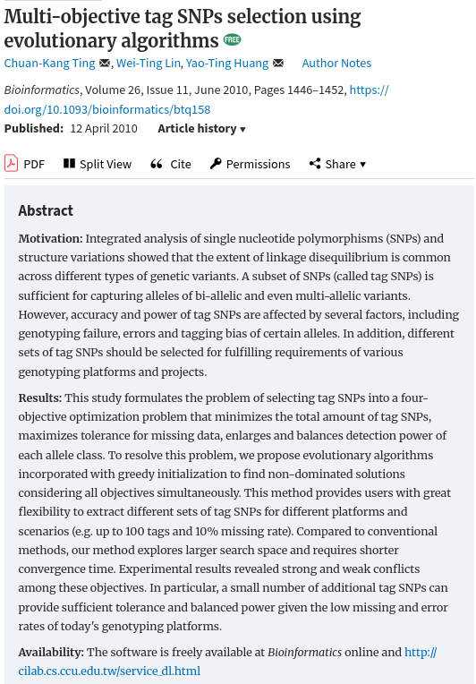
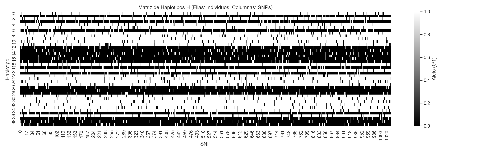

# Optimización Multiobjetivo para la Selección de Tag SNPs

Este repositorio contiene la implementación de un pipeline modular basado en algoritmos evolutivos multiobjetivo (MOEAs) diseñado para resolver el problema de selección de **Tag SNPs**. El sistema permite identificar conjuntos reducidos de polimorfismos de nucleótido único (SNPs) que preservan la variabilidad genética necesaria para estudios de asociación genómica, equilibrando la eficiencia computacional con la precisión biológica.

## Índice

1. **[Introducción](#sección-1-introducción)**
   * Contexto académico del problema.
   * Enfoque evolutivo multiobjetivo.
2. **[Marco Experimental](#sección-2-marco-experimental)**
   * Datasets (Hinds et al. y Sintéticos).
   * Objetivos de optimización.
   * Algoritmos e Inicializaciones.
   * Parámetros configurables.
3. **[Ejecución y Estructura del Proyecto](#sección-3-ejecución-y-estructura-del-proyecto)**
   * Dependencias e Instalación.
   * Uso de la CLI.
   * Arquitectura del paquete `snp_tag`.
4. **[Profundizamiento de Algoritmos y Motor Evolutivo](#sección-4-profundizamiento-de-algoritmos-y-motor-evolutivo)**
   * Implementación y Operadores (UX, Bitflip).
   * Direcciones de Referencia (Das-Dennis).
   * Motor de Paralelización y Gestión de Recursos.
   * Gestión de Escalas y Normalización.

---

## Sección 1: Introducción

### Contexto Académico del Tag SNP Selection Problem (TSSP)

El mapeo de variantes genéticas responsables de enfermedades complejas se basa frecuentemente en estudios de asociación de genoma completo (**GWAS**). Sin embargo, la densidad de SNPs en el genoma humano y el fenómeno del **Desequilibrio de Ligamiento (LD)** —la asociación no aleatoria de alelos en diferentes loci— generan una redundancia masiva de información. 

El problema de selección de **Tag SNPs** (TSSP) consiste en seleccionar un subconjunto mínimo de SNPs (los "Tags") que puedan representar o "etiquetar" al resto de variantes con una pérdida mínima de información. La resolución óptima de este problema es crucial para reducir los costes de genotipado sin sacrificar el poder estadístico de los estudios genéticos.

### Enfoque Evolutivo Multiobjetivo

Dada la naturaleza combinatoria y la presencia de objetivos en conflicto (como minimizar el número de SNPs frente a maximizar la representatividad), este proyecto aborda el TSSP mediante un marco de **Optimización Multiobjetivo**. 

En lugar de colapsar las métricas en una única función de aptitud, se emplean algoritmos evolutivos para explorar el **Frente de Pareto**. Este enfoque permite obtener una colección de soluciones óptimas que ofrecen diferentes compromisos (*trade-offs*) entre:

* **Compacidad**: Minimización del número de marcadores seleccionados.
* **Tolerancia**: Maximización de la robustez frente a la pérdida de datos.
* **Distancia Hamming**: Maximización de la diversidad representativa.
* **Disimilitud**: Optimización del equilibrio (balance de varianza) entre marcadores.

---

## Sección 2: Marco Experimental

Esta sección describe los componentes fundamentales del entorno de experimentación, incluyendo la naturaleza de los datos, las métricas de optimización y la configuración del motor evolutivo.

### Datos

El pipeline está diseñado para operar sobre estructuras genómicas complejas, validando su eficacia tanto en entornos biológicos reales como en simulaciones controladas.

#### Hinds et al. (2005) - Benchmark Real

Este dataset, extraído de los estudios de Perlegen Sciences, representa el estándar de oro en la literatura de Tag SNPs. Consta de **1032 SNPs** y **48 haplotipos**, caracterizándose por una arquitectura genética altamente estructurada.

> En la ejecución de referencia (`20260418T174114`), el sistema detectó una estructura de **28 bloques de ligamiento** con una correlación media absoluta (|r|) de **0.0776**.


*Figura 1: Representación matricial de los haplotipos (0/1) del dataset de Hinds et al. (2005).*


*Figura 2: Visualización de los 28 bloques de ligamiento detectados en el dataset de Hinds et al. (2005).*

El análisis de similitud genotípica revela una diversidad equilibrada, con distancias de Hamming que oscilan entre el percentil 33 (P33=237.0) y el percentil 66 (P66=273.0), permitiendo evaluar la capacidad de los algoritmos para preservar variaciones sutiles.


*Figura 3: Histograma de distancias de Hamming, reflejando la complejidad de la variación inter-haplotípica.*

##### Procedencia y Adquisición (Arqueología de Datos)

La obtención del dataset de Hinds et al. (2005) fue un proceso de "arqueología de datos" para asegurar la replicación exacta de los experimentos de Moqa et al. (2022):

1. **Identificación de la Fuente Original**: El artículo de Moqa et al. (2022) cita el dataset original, pero la metodología específica de uso del bloque de 1032 SNPs proviene de Ting et al. (2010), el artículo precursor.
2. **Rastreo del Artículo de Ting (2010)**: Se localizó el software y los datos originales depositados en el sitio web del laboratorio de los autores en la Universidad Nacional Chung Cheng (CCU) de Taiwán.
   
   *Figura 4: Captura de pantalla del sitio oficial de Ting et al. (2010). Fuentes:* [[Artículo Académico]](https://academic.oup.com/bioinformatics/article/26/11/1446/203000?login=false) | [[Repositorio CCU]](http://cilab.cs.ccu.edu.tw/service_dl.html)
3. **Localización y Descarga**: Se accedió a un servidor activo (`cilab.cs.ccu.edu.tw`) que contenía el archivo `Code_MoTagSNPsSel.zip`. Dentro de este paquete se recuperó el fichero `input.txt`.
4. **Verificación de los Datos**: Se confirmó que el fichero cumplía con las especificaciones exactas: 48 filas por 1032 columnas en formato de texto binario plano, validado explícitamente por el README de Ting como el bloque utilizado en los estudios de referencia.
5. **Integración en el Proyecto**: Los datos se integran como `snp_tag/data/datasets/hinds2005_1032.txt`, y se cargan mediante `cargar_bloque_hinds2005`, que interpreta este formato binario (diferente de estándares HapMap).

En resumen, el dataset no fue descargado de una base de datos genómica general, sino directamente del **paquete de replicación oficial** de los autores originales, garantizando la integridad absoluta de las comparativas de *benchmarking*.

#### Datasets Sintéticos - Simulación Controlada

Los datos sintéticos se generan mediante procesos estocásticos para evaluar la robustez y escalabilidad. En las pruebas realizadas (modo `fast`), se suele configurar una matriz de **1032 SNPs x 40 haplotipos**.

A diferencia de la rigidez de los datos biológicos, el generador sintético permite diseñar escenarios experimentales a medida, facilitando el análisis del comportamiento de los algoritmos bajo condiciones controladas de diversidad y ruido. Esta flexibilidad se gestiona a través de los parámetros tunables en `user_config.ini`:

* `num_bloques`: Define el número de bloques genómicos en los que se divide la secuencia, permitiendo simular distintos grados de fragmentación del ligamiento.
* `n_snps`: Determina la escala global de la simulación (columnas de la matriz). *(El número de haplotipos es fijo por fuente de datos: 48 en Hinds y 40 en synthetic.)*
* `prob_flip_sintetico`: Determina la probabilidad de inversión de bits (mutación) por cada SNP, controlando el nivel de ruido y la imperfección del ligamiento.
* `dif_min_pares_sintetico`: Establece la distancia Hamming mínima exigida entre pares de haplotipos para garantizar la divergencia biológica.
* `intentos_max_sintetico`: Especifica el número máximo de iteraciones para satisfacer las restricciones de diversidad impuestas.


*Figura 5: Mapa de calor de la estructura haplotípica sintética, donde se observa la regularidad impuesta por el modelo de simulación.*

La distribución de distancias en datos sintéticos muestra extremos más polarizados (P33=145.0, P66=887.0), lo que resulta ideal para evaluar el rendimiento de los algoritmos en escenarios de alta divergencia genética inducida.

### Suite de Diagnóstico y Caracterización

Antes de iniciar la búsqueda evolutiva, el sistema ejecuta un diagnóstico exhaustivo para caracterizar la arquitectura del conjunto de datos. Este análisis preliminar permite comprender la complejidad del espacio de búsqueda y validar la integridad biológica de las entradas.

#### Dimensiones del Análisis:

* **Estructura de Haplotipos e LD**: Visualización de patrones alélicos y detección automatizada de bloques de ligamiento basados en "hotspots" de recombinación.
* **Variabilidad y Frecuencia**: Estudio de la distribución de frecuencias alélicas y variabilidad por SNP, incluyendo el análisis de alelos dominantes.
* **Desequilibrio de Ligamiento (LD)**: Cálculo de la correlación media absoluta global ($|r|$) y generación de matrices de correlación completa con sus respectivas distribuciones estadísticas (CDF).
* **Similitud Genotípica**: Caracterización de la diversidad inter-haplotípica mediante distancias de Hamming, identificando pares de individuos con extrema similitud o divergencia funcional.

Esta fase genera un reporte detallado en la terminal y un conjunto de visualizaciones en la carpeta de resultados (subdirectorio `0_datos_previos`), proporcionando una "huella digital" del dataset antes de proceder con el motor evolutivo.

<details>
<summary><b>Ver ejemplo de salida de terminal (Diagnóstico)</b></summary>

```text
╔══════════════════════════════════════════════════════════════════════════════╗
║                  DIAGNÓSTICO DE DATOS Y DESEQUILIBRIO (LD)                   ║
╚══════════════════════════════════════════════════════════════════════════════╝

  🧬 Visualización de la Estructura de Haplotipos
  ──────────────────────────────────────────────────
      🖼️  Mapa de calor de haplotipos: heatmap_haplotipos_full.png
      🖼️  Estructura LD (28 bloques): bloques_ld_haplotipos_full.png

  📈 Análisis de Variabilidad y Frecuencia Alélica
  ───────────────────────────────────────────────────
      🖼️  Distribución de frecuencia alélica: histograma_alelico_full.png
      🖼️  Variabilidad por SNP: variabilidad_snps_full.png
      🖼️  Alelos dominantes por haplotipo: conteo_alelos_full.png
      🖼️  Distribución de distancias de Hamming: histograma_hamming_full.png

  🔗 Caracterización Global de Correlación (LD)
  ──────────────────────────────────────────────
      • Correlación media absoluta (global |r|): 0.0776
      • Total de pares evaluados: 531996
      🖼️  Mapa de calor de correlación (LD): heatmap_correlacion_completa_full.png
      🖼️  Distribución de correlaciones (LD): histograma_correlaciones_ld_full.png
      🖼️  CDF de correlación LD: cdf_correlacion_absoluta_ld_full.png

  ⚖️ Resumen Estructural del Dataset
  ───────────────────────────────────
      • Estructura detectada: 28 bloques de ligamiento
      • Correlación media absoluta (|r|): 0.0776
      • Naturaleza del dato: Benchmark biológico (Hinds)

  📐 Análisis de Similitud Genotípica (Pares de Haplotipos)
  ──────────────────────────────────────────────────────────
      • Número de pares de haplotipos: 1128
      • Pares mostrados: 3 similares / 3 distintos
      • Vista parcial: primeros 32 SNPs
      • Percentiles (Hamming): P33=237.00, P66=273.00
      • [Etiquetas: <=P33 -> muy similar | (P33,P66] -> intermedio | >P66 -> muy distinto]

    🤝 Pares de mayor similitud genética
      •  Par (26, 27) | Hamming=129 | muy similar
        h026: 00000000000000100111100000000000...
        h027: 01011101111110000010011000000...
      •  Par (17, 41) | Hamming=134 | muy similar
        h017: 01011101111110000010011000000...
        h041: 01011101111110000010011000000...
      •  Par (36, 46) | Hamming=140 | muy similar
        h036: 00000000000000100111101001100000...
        h046: 01011101111110000010011000000...

    ↔️ Pares de mayor divergencia genética
      •  Par (29, 36) | Hamming=407 | muy distinto
        h029: 00000010000000011000000000000000...
        h036: 00000000000000100111101001100000...
      •  Par (28, 29) | Hamming=404 | muy distinto
        h028: 00000010000000011000000000000000...
        h029: 00000010000000011000000000000000...
      •  Par (24, 29) | Hamming=390 | muy distinto
        h024: 01011101111110000010011000000...
        h029: 00000010000000011000000000000000...
```

</details>

### Objetivos de Optimización

El motor evolutivo busca optimizar simultáneamente cuatro dimensiones críticas:

1. **Compacidad**: Minimización del número de SNPs seleccionados. El objetivo es encontrar el conjunto representativo más pequeño posible.
2. **Tolerancia**: Maximización de la robustez ante datos perdidos. Evalúa la capacidad del conjunto de Tag SNPs para mantener la representatividad en presencia de errores de lectura.
3. **Distancia Hamming**: Maximización de la diversidad representativa. Busca maximizar la distancia genética promedio para asegurar que los Tags cubran el espacio de variabilidad del dataset.
4. **Disimilitud (Balance de Varianza)**: Optimización del equilibrio entre marcadores. Se centra en balancear la información proporcionada por cada SNP seleccionado para evitar redundancias internas.

### Algoritmos e Inicializaciones

El sistema implementa un entorno comparativo que evalúa la sinergia entre diferentes algoritmos y estrategias de población inicial:

* **Algoritmos Soportados**:
  
  * **NSGA-II**: Non-dominated Sorting Genetic Algorithm II.
  * **NSGA-III**: Evolución del anterior, especializado en problemas many-objective.
  * **SPEA2**: Strength Pareto Evolutionary Algorithm 2.
  * **MOEA/D-TCHE**: Variante de MOEA/D con descomposición Tchebycheff.
  * **MOEA/D-PBI**: Variante de MOEA/D con descomposición Penalty-based Boundary Intersection (\(\theta\) configurable).
  * **MOEA/D-WS**: Variante de MOEA/D con descomposición Weighted Sum.
  
  La selección final de algoritmos a ejecutar es totalmente configurable mediante la lista tunable `algoritmos_activos`.

* **Estrategias de Inicialización**:
  
  * `random_sparse`: Inicialización estocástica centrada en la **eficiencia y compacidad**. Activa cada SNP con una probabilidad baja (basada en $70/N_{snps}$), generando soluciones con pocos marcadores. Esto evita que el algoritmo comience en zonas de sobredimensión, favoreciendo la búsqueda de conjuntos mínimos de Tags desde la primera generación.
  * `random_dense`: Muestreo aleatorio estándar (probabilidad 0.5 por bit). Proporciona una **cobertura masiva y redundante** del genoma. Es ideal para evaluar la capacidad de "poda" de los algoritmos, permitiendo que la evolución descarte los marcadores que no aportan información discriminatoria adicional.
  * `greedy_pure`: Estrategia constructiva de **alto rendimiento biológico** alineada con Ting: en cada individuo greedy, se añaden SNPs hasta cubrir el 100% de los pares de haplotipos (coverage=1 por par), con desempate estocástico en SNPs de igual distinguibilidad.
  * `greedy_hybrid`: Enfoque de **compromiso explotación-exploración**. Combina un 50% de soluciones greedy y un 50% de individuos aleatorios, manteniendo la parte aleatoria con probabilidad de bit configurable (`prob_aleatoria_gi`, por defecto 0.5).

##### Detalle Técnico de las Estrategias de Muestreo

Para optimizar la búsqueda en el espacio binario, el motor de inicialización implementado en `snp_tag/core/sampling.py` utiliza las siguientes mecánicas avanzadas:

* **Priorización por Distinguibilidad**: Los SNPs no se eligen al azar en las estrategias voraces; se ordenan según su capacidad para discriminar entre clases alélicas. Este "score" asegura que los primeros marcadores seleccionados maximicen la resolución del dataset.
* **Desempate Estocástico**: Ante SNPs con idéntico valor de distinguibilidad, el sistema introduce permutaciones aleatorias para evitar que todos los individuos *greedy* sean idénticos, fomentando la diversidad genética en el frente inicial.
* **Densidad Adaptativa**: En `random_sparse`, la probabilidad de activación se ajusta dinámicamente según el número de variables ($P_{bit} \approx 70/N_{snps}$), garantizando que los individuos iniciales no saturen los objetivos de compacidad.

### Parámetros Configurables

El sistema permite un ajuste fino a través de perfiles predefinidos (`presets`) y parámetros específicos en `user_config.ini`:

* **Presets de Ejecución**:
  * `fast`: Ejecuciones rápidas para validación de flujo (población y generaciones mínimas).
  * `medium`: Configuración estándar para experimentos académicos equilibrados.
  * `high`: Configuración intermedia orientada a explorar más que `medium` con un coste computacional moderado.
  * `full`: Búsqueda exhaustiva diseñada para obtener el frente de Pareto más preciso.
* **Parámetros Tunables**: Incluyen probabilidades de cruce (`pc`), mutación (`pm`), lista de algoritmos activos (`algoritmos_activos`), tamaño/probabilidad de vecindad de MOEA/D, parámetro `theta_moead_pbi`, modo de semillas (`non_deterministic` o `deterministic`) y transformación de objetivos (`neg` o `inverse`).

Formato recomendado en `user_config.ini`:

```text
[Seccion]
clave = valor ; explicación
```

Ejemplo (extracto corto) de `user_config.ini`:

```ini
[General]
dir_salida_base = results ; Directorio raíz de salida de resultados

[Dataset]
n_snps = 1032 ; Número total de SNPs del bloque objetivo
num_bloques = 8 ; Número de bloques LD en los que se divide la secuencia sintética
prob_flip_sintetico = 0.03 ; Probabilidad de flip por SNP al generar datos sintéticos
dif_min_pares_sintetico = 100 ; Distancia Hamming mínima objetivo entre pares sintéticos
intentos_max_sintetico = 1000 ; Intentos máximos para forzar la distancia mínima sintética

[Objetivos]
modo_transformacion_objetivos = neg ; (neg o inverse)
modo_evaluacion = proportional ; (absoluta o proportional)

[Algoritmos]
semilla_maestra = 42 ; Semilla maestra
modo_semillas = non_deterministic ; (non_deterministic o deterministic)
pc = 0.7 ; Probabilidad de cruce
algoritmos_activos = NSGA2, NSGA3, SPEA2, MOEAD_TCHE, MOEAD_PBI, MOEAD_WS
opciones_init = random_sparse, random_dense, greedy_pure, greedy_hybrid

[Normalización]
modo_normalizacion = static_proportional_limits ; (per_algorithm, global_all_pairs, static_dataset_limits, static_proportional_limits)

[Reporting]
report_plot_dpi = 300 ; DPI de las figuras
```

<details>
<summary><b>Ver ejemplo de reporte de configuración y metadatos</b></summary>

```text
  ⚙ CONFIGURACIÓN
  ───────────────────
      • Modo=full | POP_SIZE=200 | N_GEN=500 | OFFSPRING=200 | PC=0.7 | PM=0.000969 | N_RUNS=5

  📊️ Metadatos y Dimensiones del Dataset
  ─────────────────────────────────────────
    ✅ Hinds 2005 cargado y filtrado: 48 patrones alelicos × [N_polimórficos] SNPs polimórficos (de 1032 originales)
    • ORIGEN_DATOS=hinds2005 (Hinds et al. 2005 / Perlegen) | N_SNPS=[N_polimórficos] | N_PATRONES=48 | PM=1/N_polimórficos
    • FICHERO=snp_tag/data/datasets/hinds2005_1032.txt
    • REPORT_DPI=300 | NORMALIZATION_MODE=static_dataset_limits | SEED_MODE=non_deterministic | OBJ_TRANSFORM=neg
      • REPORT_DPI=300 | NORMALIZATION_MODE=static_dataset_limits
```

</details>

---

## Sección 3: Ejecución y Estructura del Proyecto

Esta sección proporciona las instrucciones necesarias para configurar el entorno y ejecutar el pipeline de selección de Tag SNPs.

### Dependencias e Instalación

El proyecto está desarrollado en **Python 3.8+** y requiere las siguientes librerías científicas para el procesamiento de datos, optimización y visualización:

* **pymoo**: Marco de trabajo principal para la optimización multiobjetivo.
* **pandas**: Gestión y análisis de datos en formato tabular (CSVs y métricas).
* **numpy**: Operaciones numéricas y manipulación de matrices genotípicas.
* **matplotlib**: Motor base de generación de gráficos.
* **seaborn**: Visualizaciones estadísticas avanzadas (mapas de calor, boxplots, violines).
* **scipy**: Funciones estadísticas (p. ej., CDF y tests).
* **statsmodels**: Soporte estadístico adicional para visualizaciones/análisis.
* **scikit-posthocs** *(opcional)*: Post-hoc de Nemenyi (si no está instalado, el análisis se omite).

Para asegurar que todas las dependencias están instaladas, puede utilizar el siguiente comando:

```bash
pip install -r requirements.txt
```

### Interfaz de Línea de Comandos (CLI)

El sistema se ejecuta como un paquete modular a través del punto de entrada `snp_tag.main`. La ejecución se puede personalizar mediante argumentos de línea de comandos:

```bash
python -m snp_tag.main --mode [MODO] --data-source [FUENTE]
```

**Argumentos Disponibles:**

* `--mode` (`-m`): Define el preset de ejecución configurado en `snp_tag/config.py`.
  * `fast`: Validación rápida (pocos individuos/generaciones).
  * `medium`: Experimento estándar académico (recomendado).
  * `high`: Perfil intermedio entre `medium` y `full`.
  * `full`: Búsqueda exhaustiva de alta precisión para el frente de Pareto.
* `--data-source` (`-d`): Especifica el dataset objetivo.
  * `hinds2005`: Utiliza el dataset biológico real de Hinds et al. (1032 SNPs).
  * `synthetic`: Genera un dataset sintético basado en los parámetros de simulación.
* `--report-only-csv`: Activa el **Modo de Reporte Exclusivo**. Ejecuta únicamente las fases de diagnóstico post-procesado y generación de visualizaciones estadísticas (Pareto, convergencia, boxplots) utilizando resultados previos vinculados al conjunto de datos más reciente localizado en el directorio `snp_tag/input/`.
  - Permite regenerar toda la suite visual sin necesidad de relanzar el motor evolutivo.
  - No requiere argumentos adicionales; el sistema identifica automáticamente los ficheros `.csv` (detallados, históricos y frentes) necesarios.

**Ejemplos de uso:**

1. **Ejecución Estándar (Pipeline Completo):**
   
   ```bash
   python -m snp_tag.main --mode medium --data-source hinds2005
   ```

2. **Modo Reporte (Regenerar visualizaciones):**
   
   ```bash
   # Selecciona automáticamente los CSV más recientes en snp_tag/input/
   python -m snp_tag.main --report-only-csv
   ```

### Estructura del Código

El paquete `snp_tag` está organizado de forma modular para facilitar su mantenimiento y extensión:

* **`core/`**: Definiciones fundamentales del problema de optimización (variables, direcciones de referencia).

---

## Sección 4: Profundizamiento de Algoritmos y Motor Evolutivo

Esta sección describe la arquitectura técnica del motor de optimización, detallando la implementación de los algoritmos y las estrategias para maximizar el rendimiento computacional.

### Implementación y Operadores de Variación

El pipeline utiliza el marco de trabajo **PyMoo** para instanciar algoritmos de optimización multiobjetivo de vanguardia. La efectividad de la búsqueda en el espacio binario de los SNPs se apoya en operadores de variación específicamente seleccionados:

* **Uniform Crossover (UX)**: Se emplea una probabilidad de cruce equilibrada ($P_c = 0.7$). Al ser un problema donde la posición lineal de los SNPs no siempre dicta su relación funcional (especialmente en bloques LD distantes), el cruce uniforme permite una recombinación de alelos más flexible que el cruce de un solo punto.
* **Bitflip Mutation**: La probabilidad de mutación se calibra dinámicamente siguiendo la heurística $P_m = 1/N_{vars}$. Para el bloque de Hinds (1032 SNPs), esto resulta en $P_m \approx 0.000969$, asegurando que, estadísticamente, se explore un cambio de marcador por cada individuo en cada generación, manteniendo la estabilidad de las soluciones de alta calidad.

### Direcciones de Referencia (Das-Dennis)

Para algoritmos basados en descomposición o preservación de la diversidad (como **NSGA-III** y **MOEA/D**), el sistema genera un conjunto de direcciones de referencia que guían la búsqueda de forma uniforme sobre el hiperplano de los objetivos.

El motor utiliza el método de **Das-Dennis** para distribuir puntos de referencia sobre el frente de Pareto de 4 dimensiones. El número de particiones se ajusta automáticamente en función del tamaño de población configurado para garantizar una cobertura densa y balanceada de todas las regiones de compromiso (*trade-offs*).

### Motor de Paralelización y Gestión de Recursos

Dada la naturaleza estocástica de los algoritmos, el sistema orquesta múltiples **réplicas** (runs) simultáneas para asegurar la significancia estadística de los resultados. El motor de ejecución (`snp_tag/engine/runner.py`) implementa las siguientes optimizaciones:

* **Paralelismo Adaptativo**: Utiliza la utilidad `runtime.py` para calcular el número óptimo de procesos en paralelo en función de los núcleos de CPU y, fundamentalmente, de la **memoria RAM disponible**.
* **Protección de Recursos**: El sistema estima el consumo de memoria por algoritmo y limita el número de trabajadores para evitar fallos de segmentación o colapsos del sistema operativo bajo cargas intensas.
* **Semillas Configurables**: El motor soporta dos modos: `non_deterministic` (uso habitual, semillas no fijas) y `deterministic` (réplicas reconstruibles derivadas de `semilla_maestra`).

<details>
<summary><b>Ver ejemplo de ejecución del Motor Multiobjetivo</b></summary>

```text
╔══════════════════════════════════════════════════════════════════════════════╗
║                             MOTOR MULTIOBJETIVO                              ║
╚══════════════════════════════════════════════════════════════════════════════╝
  ⚙️  Configuración del Motor Evolutivo
  ─────────────────────────────────────
      • Modo=full | POP_SIZE=200 | N_GEN=500 | OFFSPRING=200 | PC=0.7 | PM=0.000969 | N_RUNS=5
      • Desglose: 4 algoritmos x 4 inicializaciones x 5 runs = 80 ejecuciones
      • Configuraciones únicas (algoritmo-init): 16
      • Puntos de referencia (ref_dirs): 165 | Particiones: 8
      • Tamaño de población (pop_size): 200

  🧬 Fase Evolutiva
  ────────────────────
    • Iniciando 80 experimentos en modo paralelo seguro
      • Paralelizando con hasta 11 procesos en paralelo
      • [Progreso:  1/80] | [NSGA2-random_dense] ejecución 4/5 (160.3s)
      ...
      • [Progreso: 80/80] | [MOEAD-greedy_hybrid] ejecución 4/5 (449.1s)
```

</details>

### 4.4 Gestión de Escalas y Normalización

El sistema implementa un robusto motor de normalización que permite convertir los resultados brutos de los objetivos (con diferentes unidades y escalas) a un espacio normalizado $[0, 1]$. Esta fase es crítica para el cálculo de indicadores de rendimiento como el **Hipervolumen**, **SumMin** y **MinSum**.

Se pueden configurar tres esquemas de escalado en `snp_tag/config.py` a través del parámetro `modo_normalizacion`:

El valor de `modo_normalizacion` se edita en `user_config.ini`.

1. **`static_dataset_limits` (Recomendado/Predeterminado)**:
   
   * Utiliza límites teóricos y empíricos calculados a partir de las propiedades intrínsecas del dataset completo (utilizando los 1032 SNPs en el caso de **Hinds et al.**).
   
   * **Lógica Técnica**: Se define un punto **Ideal** ($f_{ideal}$) que representa el máximo potencial biológico del dataset y un punto **Nadir** ($f_{nadir}$) que representa el peor escenario. La normalización se aplica mediante la fórmula:
     $$F_{norm} = \frac{f - f_{ideal}}{f_{nadir} - f_{ideal}}$$
   
   * **Ejemplificación con Dataset Hinds (1032 SNPs)**:
     Supongamos que para el bloque de Hinds, el uso de los 1032 SNPs genera una Distancia de Hamming media de **250**. En este modo, los límites fijos para el objetivo de Distancia Hamming ($f_3$) serían:
     
     * $f_{ideal} = -250$ (Mínimo valor de $-Hamming$, es decir, máxima diversidad).
     * $f_{nadir} = 0$ (Mínima diversidad).
     
     Si el **Algoritmo A** encuentra una solución con 50 SNPs y Hamming de 40:
     $$F_{norm} = \frac{-40 - (-250)}{0 - (-250)} = \frac{210}{250} = \mathbf{0.84}$$
     *(Interpretación: La solución está al 84% de distancia del óptimo teórico del dataset).*
     
     Si el **Algoritmo B** encuentra una solución con 200 SNPs y Hamming de 150:
     $$F_{norm} = \frac{-150 - (-250)}{250} = \frac{100}{250} = \mathbf{0.40}$$
     *(Interpretación: Se ha capturado el 60% del potencial de diversidad del dataset).*
   
   * **Impacto**: Proporciona una base de comparación absoluta. A diferencia de `global_all_pairs`, donde la escala [0, 1] se "estira" o "encoge" según lo que hayan encontrado los algoritmos en esa ejecución específica, aquí los valores tienen un significado unívoco respecto al dataset. Esto permite que una solución con valor 0.40 hoy signifique exactamente lo mismo que una con 0.40 en una prueba realizada meses después, independientemente de qué algoritmos se utilicen en el futuro.

2. **`global_all_pairs`**:
   
   * Determina los puntos **Ideal** (mejor) y **Nadir** (peor) dinámicamente, considerando la unión de todas las soluciones encontradas por todos los algoritmos e inicializaciones en la ejecución actual.
   * **Impacto**: Maximiza la resolución comparativa dentro de un mismo experimento, escalando los resultados para que el mejor desempeño global de la ejecución sea 0 y el peor sea 1.

3. **`per_algorithm`**:
   
   * Calcula los límites de normalización de forma independiente para cada algoritmo.
   * **Impacto**: Permite evaluar la eficiencia de exploración interna de cada metaheurística respecto a su propio rango de búsqueda. Sin embargo, dificulta la comparación directa de métricas de convergencia entre diferentes algoritmos al no compartir un marco de referencia común.
