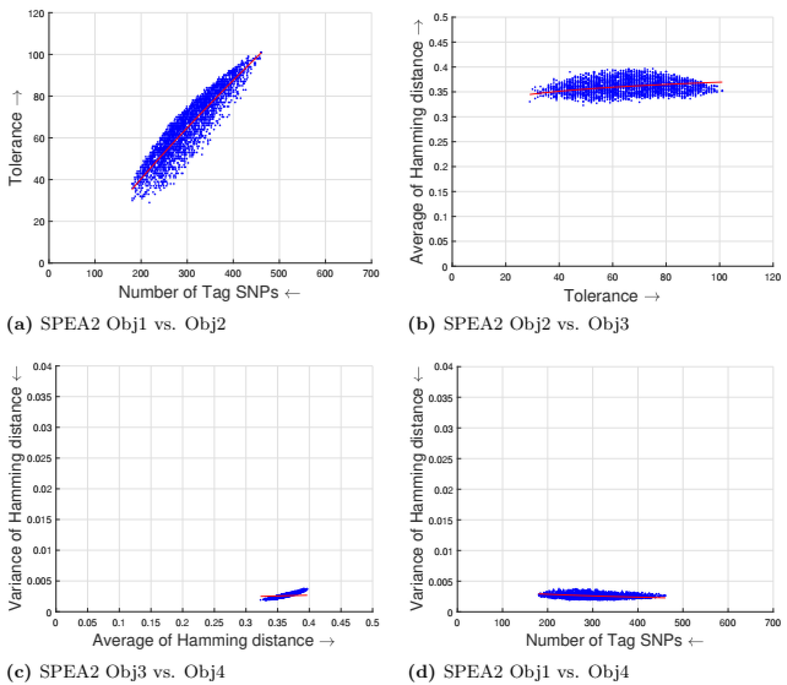
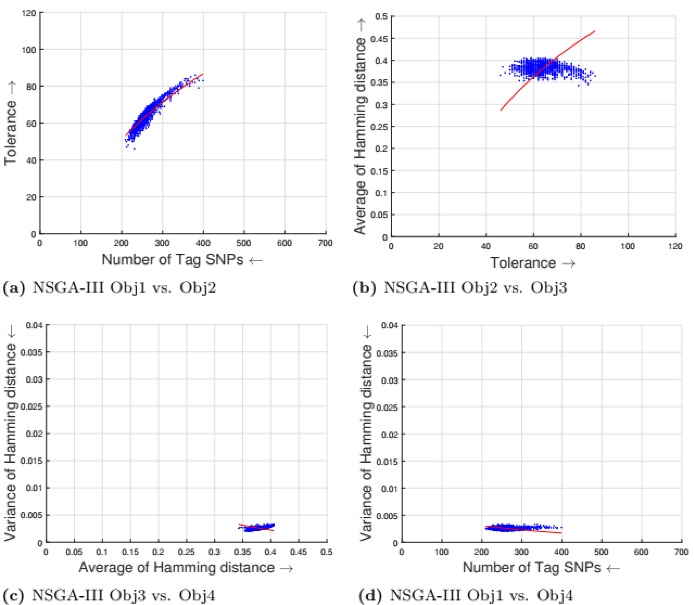
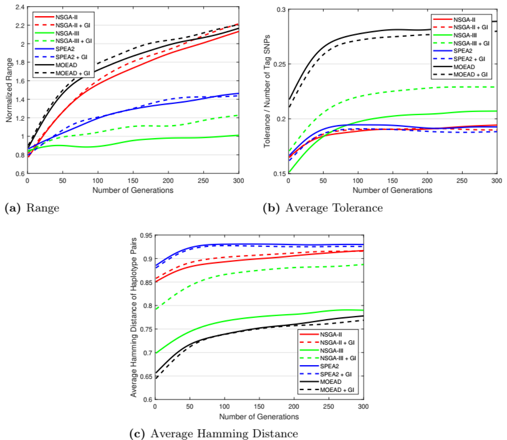

# Assessing effectiveness of many-objective evolutionary algorithms for selection of tag SNPs

_Source PDF_: `Assessing effectiveness of many-objective evolutionary algorithms for selection of tag SNPs.pdf`

---

## Page 1

RESEARCH ARTICLE
Assessing effectiveness of many-objective
evolutionary algorithms for selection of tag
SNPs
Rashad Moqa, Irfan Younas, Maryam BashirID*
FAST School of Computing, National University of Computer and Emerging Sciences, Lahore, Pakistan
* maryam.bashir@nu.edu.pk
Abstract
Background
Studies on genome-wide associations help to determine the cause of many genetic dis-
eases. Genome-wide associations typically focus on associations between single-nucleo-
tide polymorphisms (SNPs). Genotyping every SNP in a chromosomal region for identifying
genetic variation is computationally very expensive. A representative subset of SNPs, called
tag SNPs, can be used to identify genetic variation. Small tag SNPs save the computation
time of genotyping platform, however, there could be missing data or genotyping errors in
small tag SNPs. This study aims to solve Tag SNPs selection problem using many-objective
evolutionary algorithms.
Methods
Tag SNPs selection can be viewed as an optimization problem with some trade-offs
between objectives, e.g. minimizing the number of tag SNPs and maximizing tolerance for
missing data. In this study, the tag SNPs selection problem is formulated as a many-objec-
tive problem. Nondominated Sorting based Genetic Algorithm (NSGA-III), and Multi-Objec-
tive Evolutionary Algorithm based on Decomposition (MOEA/D), which are Many-Objective
evolutionary algorithms, have been applied and investigated for optimal tag SNPs selection.
This study also investigates different initialization methods like greedy and random initializa-
tion. optimization.
Results
The evaluation measures used for comparing results for different algorithms are Hypervo-
lume, Range, SumMin, MinSum, Tolerance rate, and Average Hamming distance. Overall
MOEA/D algorithm gives superior results as compared to other algorithms in most cases.
NSGA-III outperforms NSGA-II and other compared algorithms on maximum tolerance rate,
and SPEA2 outperforms all algorithms on average hamming distance.
PLOS ONE
PLOS ONE | https://doi.org/10.1371/journal.pone.0278560
December 8, 2022
1 / 24
a1111111111
a1111111111
a1111111111
a1111111111
a1111111111
OPEN ACCESS
Citation: Moqa R, Younas I, Bashir M (2022)
Assessing effectiveness of many-objective
evolutionary algorithms for selection of tag SNPs.
PLoS ONE 17(12): e0278560. https://doi.org/
10.1371/journal.pone.0278560
Editor: Seyedali Mirjalili, Torrens University
Australia, AUSTRALIA
Received: October 11, 2021
Accepted: November 19, 2022
Published: December 8, 2022
Copyright: © 2022 Moqa et al. This is an open
access article distributed under the terms of the
Creative Commons Attribution License, which
permits unrestricted use, distribution, and
reproduction in any medium, provided the original
author and source are credited.
Data Availability Statement: The data underlying
the results presented in the study are available
from https://www.science.org/doi/abs/10.1126/
science.1105436.
Funding: The authors received no specific funding
for this work.
Competing interests: The authors have declared
that no competing interests exist.

**Images on this page**

- 

---

## Page 2

Conclusion
Experimental results show that the performance of our proposed many-objective algorithms
is much superior as compared to the results of existing methods. The outcomes show the
advantages of greedy initialization over random initialization using NSGA-III, SPEA2, and
MOEA/D to solve the tag SNPs selection as many-objective optimization problem.
1 Introduction
Living organisms have Deoxyribonucleic acid (DNA) which carries genetic instructions and
all genetic recipes of the living organisms. The DNA has two strands called Polynucleotides;
which are built using simple units called nucleotides [1]. A single nucleotide can be one of four
types namely, Adenine (A), Cytosine (C), Guanine (G), or Thymine (T). The double-stranded
DNAs are bounded together using the nitrogenous bases, according to the base-pairing rules
(A with T, and C with G) [1]. Human DNA is organized into packaged units called chromo-
somes (46 single or 23 pairs of chromosomes in humans). Due to the complexity and a large
number of DNA sequences, scientists face difficulties in the study of genetic instructions, so
scientists have mapped the entire DNA to a single sequence called Genome which has all the
genetic material of a given organism [1]. The stored human genome is just like a book, where
the book (genome) contains 23 chapters (chromosomes), and each chapter would have 48 to
250 million letters (A, T, C, G) without spaces [1]. The entire genome book will have over 3.2
billion letters. Most cells of the human body will have at least one copy of the book (genome).
The genome sequence of any two humans has 99.9% similarity [1]. The 0.01% variation
between genome sequences of two individuals is what makes one individual different than
another. At a specific base position in the human genome, most individuals may have base A,
but few individuals may have base T [1]. The variation at the base position of the genome is
called a single-nucleotide polymorphism (SNP), and the two possible nucleotide variations (A
or T) are the alleles of that base position [2]. Each SNP can have four alleles (A, C, G, T), but in
most cases, only two possible alleles occur in a single SNP [2].
In genetics, a genome-wide association study is an observational study of a genome-wide
set of genetic variants in different individuals. Genetic variants of humans can affect how
humans develop diseases and respond to drugs and vaccines. The genome-wide association
typically focuses on associations between SNPs and traits like major human diseases, but can
equally be applied to any other organism. The Human Genome Project (an international sci-
entific research project to determine the sequence of nucleotide base pairs that make up
human DNA), found that there are 1.42 million SNPs [3] in the human genome. It is very
expensive and time-consuming for genotyping platforms to study every individual SNP (for
example brca2 gene has around 10 thousand SNPs). It is possible to identify genetic variation
and association to phenotypes without genotyping every SNP [4, 5] in a chromosomal region,
so it is important to find a subset of SNPs that can represent all SNPs, this subset is called tag
SNPs. Tag SNPs represent the original SNPs in a region of the genome. It is important to select
tag SNPs that are few and are the best representatives. Currently, most tag SNPs selection algo-
rithms use a block-based approach, which is based on linkage disequilibrium (LD) among all
SNPs [4, 5]. Linkage disequilibrium is the non-random association of alleles at different loci in
a given population [4]. The human genome is composed of high-LD blocks called haplotype
blocks [2]. Although, small tag SNPs save the computation time of genotyping platform, there
could be missing data or genotyping errors in small tag SNPs [6, 7]. The set of tag SNPs should
PLOS ONE
Many-objective evolutionary algorithms for selection of tag SNPs
PLOS ONE | https://doi.org/10.1371/journal.pone.0278560
December 8, 2022
2 / 24

---

## Page 3

not be very small to reduce the error rate. Moreover, the distances between the different haplo-
type patterns are also taken into consideration to balance selection among all patterns. Hence,
tag SNPs selection is a multi-objective problem with some trade-offs between objectives, e.g.
minimizing the number of tag SNPs and maximizing tolerance for missing data.
The problem of finding minimum robust tag SNPs is shown to be NP-hard [6]. To find
robust tag SNPs efficiently, many algorithms have been proposed, and among these methods,
evolutionary algorithms have shown promising results. Previous approaches have mostly used
multi-objective algorithms for solving this problem [8, 9]. For Two-Three objectives, multi-
objective algorithms are reasonable enough but as the number of objectives increases to four
or more, their effectiveness decreases. Very recently, some algorithms have been proposed to
deal with four or more objectives. In this work, NSGA-III, and MOEA/D [10, 11], which are
Many-Objective evolutionary algorithms, have been applied and investigated for optimal tag
SNPs selection. The block-based approach is used with different initialization methods e.g.
(random, and greedy). The results are compared with some multi-objective algorithms like
NSGA-II, and SPEA2. The results of NSGA-III, and MOEA/D are promising for the tag SNP
selection problem.
1.1 Research contributions
This study has following research contributions:
• Application of many-objective algorithms (NSGA-III and MOEA/D) and demonstrate the
significance of using many-objective algorithms for tag SNP problem.
• Evaluate results of many-objective algorithms on benchmarks datasets.
• Comparison of results of many-objective algorithms (NSGA-III and MOEA/D) with previ-
ously applied multi-objective algorithms (NSGA-II and SPEA2).
• Demonstrate the significance of using the greedy initialization method for the first time with
NSGA-III and MOEA/D algorithms.
The rest of this paper is organized as follows. Section 2 presents the related work for block-
based tag SNPs selection. Section 3 formulates the tag SNPs selection as a many-objective
problem. Section 4 presents the proposed methodology. Section 5 summarizes the experimen-
tal results and presents a discussion on results. Finally, the conclusion and future work are pre-
sented in Section 6.
2 Related work
This section presents applications of tag SNP selection and previous research on solving tag
SNPs selection problem using evolutionary and genetic algorithms.
Tag SNP selection has many applications. Campos et al. [12] identified genomic regions
associated with growth traits in Hereford and Braford cattle and for this purpose they used dif-
ferent tag SNP selection techniques. Saher et al. [13] identified SNPs to estimate different
genetic parameters such as diversity, pairwise population differentiation, linkage disequilib-
rium (LD) distribution, and for genome-wide association study for milk yield and body weight
traits in the Nili-Ravi dairy bulls. Cattle resistance to ticks is known to be under genetic control
with a complex biological mechanism within and among breeds. Bruna et al. [14] identified
genomic SNPs associated with tick resistance in Hereford and Braford cattle. The genotype of
a single SNP, rs12913832, is the primary predictor of blue and brown eye colors [14]. Olivia
et al. [15] investigated variants that explain brown eye color formation in individuals with the
rs12913832:GG genotype. Jing et al. [16] investigated the relation between PARP1 haplotypes
PLOS ONE
Many-objective evolutionary algorithms for selection of tag SNPs
PLOS ONE | https://doi.org/10.1371/journal.pone.0278560
December 8, 2022
3 / 24

---

## Page 4

and lung cancer. They used SNP imputation in their research. Jeong et al. [17] used tag SNPs
selection for finding useful information related to the breeding of wild-species tomatoes.
In past, many algorithms and techniques have been proposed for tag SNPs selection prob-
lems. Mahdevar et al. [18] proposed a heuristic method based on a genetic algorithm for tag
SNPs of haplotype data blocks. The authors used a binary vector of length n which represents a
candidate solution in the population of genetic algorithm. The fitness function used was based
on a smaller number of haplotype SNPs and it was composed of the Shannon entropy func-
tion. Genetic operators such as selection, crossover, and mutation were applied to generate
new individuals, then the best candidate solutions that survive to the next iteration were
selected.
Gumus et al. [8] proposed a multi-objective tag SNPs selection solution using Pareto Opti-
mality. The proposed method uses Pareto Optimality to solve a multi-objective optimization
problem for tag SNPs selection, taking into account classification accuracy and correlation
between genomic and geographical distances. Experiments of the proposed method used the
SNP dataset from the Human Genome Diversity Project.
Chen et al. [19] proposed a novel method for informative SNPs selection using a genetic
algorithm. The proposed method has two phases; first for selecting informative SNPs and sec-
ond for haplotype reconstruction. First, the authors removed the repeated information of
SNPs using linkage disequilibrium values which results in small redundancy, then they used a
genetic algorithm for optimization and reconstruction of haplotypes. Authors make use of
backpropagation neural networks to rebuild the tagged SNPs, to measure the prediction accu-
racy of tag SNPs. Liu et al. [20] proposed selection for informative SNPs from large-scale data-
sets using an improved evolutionary algorithm. The proposed method developed a framework
that has two stages to ensure efficiency in selecting informative SNP from a large dataset. In
the first stage, the authors developed an improved evolutionary algorithm that selects the
informative SNP according to linkage disequilibrium. To reduce the time complexity this stage
is independent of the prediction of non-informative SNP. In the second stage, the selection of
informative SNPs is done by a forward selection scheme which is based on the performance of
prediction. The proposed method has been applied on different large datasets, and experimen-
tal results show this method can deal with large datasets effectively. Table 1 shows the sum-
mary of the most relevant related work. For each paper, we summarize the methodology,
evaluation measures, parameters, and the datasets.
Ilhan et al. [21] proposed Clonal Selection Algorithm (CLONALG) for tag SNPs selection
and compared the results with Particle Swarm Algorithm [22]. Genevieve et al. [23] proposed
a novel method for tag SNP selection using genotype-imputation strategies. Shudong et al.
[24] constructed an iterative method of selecting tag SNPs based on linkage disequilibrium
(TSOILD). They concluded that TSOILD is better than Random Sampling, Greedy Algorithm,
and TSMI methods for Tag SNP selection. Ting et al. [9] proposed a multi-objective tag SNPs
selection, in which they formulated the tag SNPs problem as multi-objective problem with
four objectives. They applied two evolutionary algorithms named non-dominated sorting
genetic algorithm-II (NSGA-II) and multiple-single-objective pareto sampling (MSOPS). The
data used was haplotype blocks that contain more than 1000 SNPs and haplotype patterns.
Authors used greedy initialization to get diverse initial solutions. Results show that the greedy
initialization improved the results of multi-objective algorithms.
For two-three objectives, multi-objective algorithms are reasonable enough but as the num-
ber of objectives increases to four or more, their effectiveness decreases. Ting el al [9] applied
two multi-objective algorithms (NSGA-II and MSOPS) to tag SNP selection problem. How-
ever, there are some shortcomings of these two algorithms. The performance of NSGA-II dete-
riorates when the number of objectives increases. Due to the loss of selection pressure, the
PLOS ONE
Many-objective evolutionary algorithms for selection of tag SNPs
PLOS ONE | https://doi.org/10.1371/journal.pone.0278560
December 8, 2022
4 / 24

---

## Page 5

convergence of the algorithm is affected. Similarly, slow convergence and lack of diversity of
solutions are the two main shortcomings of MSOPS [25]. To address these shortcomings, we
suggest NSGA-III and MOEA/D [10, 11], which are many-objective evolutionary algorithms
to solve tag SNPs selection problem effectively. In NSGA-III and MOEA/D, these issues are
handled using a diverse set of weight vectors, which helps to keep the diverse solutions and
maintains an appropriate selection pressure for solving many-objective optimization problems
effectively.
3 Problem formulation
This section formulates the many-objective tag SNPs selection problem. The number of tag
SNPs is just a subset of a large number of SNPs that can distinguish any given haplotype pat-
tern. SNP is the variation at the base position of the genome, and the two possible nucleotide
variations are the alleles of that base position [4]. A haplotype block is a set of closely linked
alleles/markers on a chromosome that, over evolutionary time, tend to be inherited together
[4, 5]. A set of tag SNPs is defined as a set of SNPs that can distinguish any two allele classes
[9]. Tag SNPs can be defined as follows.
(Tag SNPs): Given a set of N SNPs S = {S1, . . ., Sn} and M allele classes P = {P1, . . ., Pm}, let
P(i,k) 2 {0, 1} denote the kth value of haplotype class Pi 2 {0, 1}n, where 0 and 1 indicates two
possible alleles. A set of tag SNPs ST is a subset of S that can distinguish any two allele classes.
That is, for any two allele classes Pi and Pj, there exists at least one tag SNP Sk 2 ST such that P
(i,k) 6¼ P(j,k) [9]. For example
S1
S2
S3
S4
S5
P1
0
0
1
0
1
P2
0
1
1
0
0
P3
1
0
0
0
0
P4
1
1
0
1
1
is a haplotype block with four different allele classes each with five SNPs. Two SNPs S1 and S2
are sufficient to distinguish any of the four allele classes, because P(i,3) = P(i,1), P(i,4) = P(i,1) ×
P(i,2), and P(i,5) = P(i,1)  P(i,2) for i = 1,2,3,4. The tag SNPs selection problem is formally defined
as follows: Given M allele classes P = {P1, . . ., Pm} find the smallest tag SNPs set ST = {S1, . . .,
Sk} and vector function V: {0, 1}k ! {0, 1}n such that V(P(i,1), P(i,2), . . ., P(i,k)) = Pi for each Pi 2
P.
Table 1. Summary of the most relevant related work.
Paper
Methodology
Evaluation Measures
Parameters
Dataset
Multi-objective tag SNPs selection using
evolutionary algorithms [9]
NSGA-II and
MSOPS
Relation between objectives, Range,
SumMin, MiniSum, Max and Avg
tolerance rate and hamming distance
Population size: 200,
Generations: 500
Haplotype block of 1032
SNPs
Tag SNP selection via a genetic algorithm
[18]
Genetic algorithm
Overhead 2-8%
Population size: 100,
Generations: 100
Chromosome 21 from
European population with
34,103 SNPs
Tag SNP Selection Using Similarity
Associations Between SNPs [21]
Clonal selection
algorithm
Prediction accuracy 96.7%
Generations: 20, pool
size: 20, cloning factor: 1
Seven different datasets of
different sizes and SNP
numbers
Imputation-Aware Tag SNP Selection to
Improve Power for Large-Scale, Multi
ethnic Association Studies [23]
Genotype-
imputation
strategies
Imputation accuracy 0.5–7.1%
Thresholds of r2 > 0.5,
Minor allele frequency
1%
26 populations from Phase 3
of the 1000 Genomes Project
https://doi.org/10.1371/journal.pone.0278560.t001
PLOS ONE
Many-objective evolutionary algorithms for selection of tag SNPs
PLOS ONE | https://doi.org/10.1371/journal.pone.0278560
December 8, 2022
5 / 24

---

## Page 6

The multi-objective tag SNPs selection problem is to select a set of tag SNPs that minimizes
the total amount of selected SNPs, maximizes their robustness against missing data, maximizes
the pair-wise distance among allele classes, and minimizes the variance of these pairwise dis-
tances [9]. These four objectives are formally defined below.
3.1 Compactness
The first objective is to reduce the number of tag SNPs as much as possible so that the compu-
tation time for genotyping platforms is saved [9]. This objective can be defined as
min k ST k
ð1Þ
where kSTk denotes cardinality of set ST of selected tag SNPs.
3.2 Tolerance
The second objective is to maximize the tolerance for missing data of selected tag SNPs. Let
Dij(ST) denote the number of selected tag SNPs in ST which are able to distinguish two haplo-
type patterns Pi and Pj. The minimum cardinality of Dij(ST) among all pairs of alleles gives the
number, i.e. min(||Dij(ST)||) −1, of missing SNPs that the set ST of tag SNPs can tolerate [26].
The second objective can be defined as
maxðmin k DijðSTÞ kÞ
ð2Þ
3.3 Dissimilarity
This objective aims to generate dissimilar haplotype backgrounds for distinct allele classes.
Similarity on haplotype patterns is calculated by Hamming distance [27] on selected tag SNPs.
Let KT be the index set of ST.
ST ¼ [
k2KTSk
ð3Þ
The Hamming distance for given two allele classes Pi and Pj is defined by
HðPi; PjÞ ¼
X
k2KT
jPi;k  Pj;kj
ð4Þ
This objective tries to maximize average Hamming distance for all pairs of haplotype pat-
terns.
max 
H
The average hamming distance can be defined as

H ¼
1
m
2

!
X
0i<jm
HðPi; PjÞ
ð5Þ
PLOS ONE
Many-objective evolutionary algorithms for selection of tag SNPs
PLOS ONE | https://doi.org/10.1371/journal.pone.0278560
December 8, 2022
6 / 24

---

## Page 7

3.4 Balance
This objective aims to balance tag SNPs for every haplotype pattern. It minimizes a variance
on the distances calculated on the third objective, between all pairs of haplotype patterns for a
given solution of tag SNPs [9]. This objective will produce unbiased tag SNPs which can be dis-
tinguishing patterns. So, the fourth objective is minimizing the variance by
minVarðHÞ
with
varðHÞ ¼
1
m
2

!
X
0i<jm
ðHðPi; PjÞ  
HÞ
2
ð6Þ
4 Proposed methodology
For solving the tag SNPs with many objectives, the proposed method uses different initializa-
tion methods and integrates them into evolutionary many-objective optimization algorithms
NSGA-III and MOEA/D [10, 11].
Evolutionary algorithms (EA) use the techniques and methods inspired by biological evolu-
tion, like selection, reproduction, mutation, and recombination. Fitness function determines
the goodness of solutions. EA repeatedly applies its operators in each iteration, which improves
the candidate solutions in each iteration and moves the solutions toward the optimal solution.
4.1 Similarities and differences between the existing and proposed methods
Ting et al. [9] considered four objectives in the tag SNPs selection problem, and solved the
optimization problem using NSGA-II, and MSOPS, which are two famous evolutionary algo-
rithms. NSGA-II is a multi-objective Pareto-based approach that has been successfully applied
to solve optimization problems with two or three objectives. However, as the number of objec-
tives increases to four or more, it gets hard to differentiate between different solutions in the
population and a large fraction of solutions become non-dominated trade-off solutions. Due
to the loss of the selection pressure, NSGA-II like other multi-objective algorithms is unable to
differentiate between solutions, which slows down the search and overall degrades the perfor-
mance of the algorithm. The MSOPS, an aggregation-based approach exhibiting the advan-
tages of both aggregation and Pareto-based evolutionary algorithms, is used to solve many-
objective optimization problems. Nevertheless, slow convergence and lack of diversity of solu-
tions are the two main shortcomings of MSOPS [25].
To address the aforementioned problems of NSGA-II, and MSOPS, we suggest two widely
used many-objective evolutionary algorithms NSGA-III [10], and MOEA/D [11]. Similar to
NSGA-II and MSOPS, NSGA-III and MOEA/D are Pareto-based, and aggregation-based
search methods, respectively. NSGA-III is an extension of NSGA-II to solve many-objective
optimization problems (with 4 or more objectives) effectively. The NSGA-III algorithm [10]
can be used for many-objective problems with at most 15 objectives. Similar to NSGA-II,
NSGA-III uses fast non-dominated sorting to rank solutions on fronts. To select a subset of
solutions from the same front, crowding distance is used in NSGA-II. On the other hand,
NSGA-III replaces the crowding distance procedure with an improved method that uses uni-
formly spread reference vectors and niching to maintain a balanced search in all directions of
the search space. The NSGA-II generates near-optimal solutions for optimization problems
PLOS ONE
Many-objective evolutionary algorithms for selection of tag SNPs
PLOS ONE | https://doi.org/10.1371/journal.pone.0278560
December 8, 2022
7 / 24

---

## Page 8

with two or three objectives. But the performance of NSGA-II is not effective for a large num-
ber of objectives. The reason is the augmented likelihood of non-dominance. In NSGA-III,
this issue is dealt with using a diverse set of weight vectors, which helps to keep the diverse
solutions and maintains an appropriate selection pressure for solving many-objective optimi-
zation problems effectively. MSOPS and MOEA/D both use an aggregation-based approach
for the fitness assignment; however, uniformly spread weight vectors are used in MOEA/D,
which help to explore different regions in the search space and maintain a diverse set of solu-
tions. MOEA/D decomposes a multi-objective optimization problem into many single-objec-
tive optimization subproblems, then it optimizes these subproblems simultaneously. Each
solution is associated with a subproblem, and each subproblem is optimized by using informa-
tion from its neighborhoods. In MOEA/D, a set of weight vectors is used to specify several sub-
regions in the objective space. Furthermore, each weight vector also defines a subproblem for
fitness evaluation. The parent population is updated in a steady-state scheme, where only one
offspring solution is considered each time.
The components and operators of the proposed many-objective GAs are described in the
following subsections.
4.2 Representation and fitness function
One candidate solution which has a set of selected tag SNPs, is a binary vector or chromosome
c = [c1, . . ., cn], where single gene ck 2 {0, 1} denotes if SNP Sk is selected or not. If it is selected
then ck is 1 else it is 0. As a result, every binary vector of length n is a feasible solution, and evo-
lutionary operators must be able to produce it. For example for the candidate c = [
1
0
1
0
0
], with n = 5, the number of tag SNPs ST = {S1, S3} is 2 and only the first, and third
SNPs are selected.
The many-objective tag SNPs selection problem considers four objectives (compactness,
tolerance, dissimilarity, and balance). Having many objectives, the proposed method uses the
concept of dominance. Given two chromosomes (a, and b), chromosome (a) is better or domi-
nates chromosome (b), if one more objective of (a) are better than objectives of (b) and (a) is
not worse compared to chromosome (b) on any of the rest of the objectives. So a superior rank
can be assigned to chromosome (a). In case neither chromosome (a) nor chromosome (b) is
dominated, both chromosomes are nondominated and both will be at the same rank. The set
of nondominated solutions is known as the Pareto front. The fitness function of a solution (a)
for M objectives can be calculated as follows:
f ðaÞ ¼
X
M
i¼1
rankðfiðaÞÞ
ð7Þ
where rank(fi(a)) provides the rank of (a) in a set of solutions according to objective fi. The
best objective value is ranked 1 and the worst objective value is ranked N. Given two solutions
(a, and b), if f(a)<f(b), then (a) dominates (b) [28].
4.3 Initialization
The first step in Genetic Algorithms (GAs) is to initialize a set of chromosomes as the initial
population. The initialization usually generates chromosomes randomly. Conventional multi-
objective GAs result in candidate solutions being gathered close to the middle of the objective
space. An initialization based on the greedy method [9] addresses the issue of random initiali-
zation. The two different initialization methods (random, greedy) have been investigated in
this study.
PLOS ONE
Many-objective evolutionary algorithms for selection of tag SNPs
PLOS ONE | https://doi.org/10.1371/journal.pone.0278560
December 8, 2022
8 / 24

---

## Page 9

The greedy initialization defines the ability to distinguish of an SNP Sk as the number of
allele pairs it can distinguish. For example,
S1
S2
S3
S4
S5
S6
S7
S8
P1
0
0
1
0
1
0
0
1
P2
0
1
1
0
0
0
1
1
P3
1
0
0
0
0
1
0
0
P4
1
1
0
1
1
0
1
1
P5
0
0
1
1
1
0
0
0
P6
1
0
1
0
0
0
1
1
distinguishability
9
8
8
8
9
5
9
8
if the ability to distinguish SNP S1 is 9 then it means that the SNP S1 can distinguish 9 different
allele pairs, while SNP S6 can distinguish 5 different allele pairs.
Greedy initialization works as follows. A variant of the set cover problem can be used to
solve the tag SNPs selection problem [6]. In the set cover problem, each element must be cov-
ered by a specified number of sets, it is known as coverage. SNPs are sorted based on distin-
guishability in descending order. For each chromosome, sorted SNPs are iteratively selected
until all elements are covered. In the end, the initial population will have chromosomes with
respect to different coverage. So, this greedy initialization would result in a good initial popula-
tion with broader solutions and promising exploration of solution space than random
initialization.
4.4 Genetic operators
Genetic Algorithm (GA) selects chromosomes of the initial population as parents, then per-
forms crossover and mutation operations to generate the offspring. The binary tournament is
used for selection, it picks the best chromosome to be a parent from two random chromo-
somes. Two parents are selected in this manner, then GA uses both crossover and mutation
operators on selected parents to generate two new offspring. Crossover combines parts of the
parents, whereas mutation changes the offspring a little bit. In this work, uniform crossover
[29] is used. The bit-flip mutation flips genes (i.e.0 ! 1, 1 ! 0) given mutation rate Pm. GA
generates a set of offspring, combines parents and offspring, then selects the fittest chromo-
somes for the next generation. After generating a set of offspring, GA applies the principle of
‘survival of the fittest. Restated, only the fittest chromosomes are selected to survive into the
next generation. This article makes use of the above-stated strategies of NSGA-III and MOEA/
D for survival selection concerning many objectives.
5 Experimental results and discussion
This work leads a progression of analyses to assess the proposed techniques on the many-
objective tag SNPs selection problem. All experiments use the data of population haplotypes
from Hinds et al. (2005) dataset [2], where they characterized whole-genome patterns of com-
mon human DNA variation by genotyping 1,586,383 SNPs in three population samples,
Americans of European, African, and Asian ancestry. Haplotype patterns are combined
together to form one haplotype block. This proposed method uses those haplotype blocks
whose number of SNPs is greater than 1000. In these experiments, a block of 1032 SNPs is
used.
PLOS ONE
Many-objective evolutionary algorithms for selection of tag SNPs
PLOS ONE | https://doi.org/10.1371/journal.pone.0278560
December 8, 2022
9 / 24

---

## Page 10

Table 2 shows the parameter setting for the proposed many-objective evolutionary algo-
rithms based on NSGA-II, NSGA-III, SPEA2, and MOEA/D. All the compared optimization
algorithms are set as suggested by the authors in the the study [9]. Experimental results for
four objectives are shown in Figs 1 to 8. Each plot shows the relation between two objectives,
where each axis represents one objective and arrows show the direction of optimization for a
given objective. Moreover, a regression line of the power function y = axb + c is plotted to
show the spread and diversity of solutions.
Figs 1 to 4 illustrate the experimental results for random initialization on NSGA-II,
NSGA-III, SPEA2, and MOEA/D. Solutions obtained by NSGA-II, NSGA-III, and SPEA2 are
close to the center of the objective space, whereas the solutions obtained by MOEA/D are
more spread across the objective space. Specifically, algorithms NSGA-II, NSGA-III, and
SPEA2 fail to find solutions with fewer than 150-170 SNPs, but MOEA/D can find solutions
with fewer (almost 25) tag SNPs. The three algorithms do not cover objective space like
MOEA/D. To resolve this issue, the distribution of initial solutions is required to cover more
diversity from objective space.
Figs 5 to 8 illustrate the experimental results for greedy initialization on NSGA-II,
NSGA-III, SPEA2, and MOEA/D. The solutions obtained by greedy initialization show more
diversity which is important for many objective optimization problems. The diversity gives
many options to users for choosing a suitable solution for different scenarios. Greedy initiali-
zation gives SNPs with high distinguishability and increases the dissimilarity between haplo-
type patterns (the third objective) which leads toward optimal solutions.
When the initial population is randomly initialized, the individuals (solution vectors) are
uniformly spread throughout the search space. The main difference in performance is due to
the difference in parent selection procedures of NSGA-II and MOEA/D. Each new solution
(offspring) is generated using the selected parents. In random initialization, as the solutions
are far away from each other, there is a high probability that the selected parent solutions are
distant from each other. If the parents are distant from each other, the generated offspring will
most likely be quite different from their parents and they may lie in the far regions of the
search space that may enhance exploration thus it can take more generations to converge to
the optimal. On the contrary, in MOEA/D, while updating a solution (offspring generation),
the parent solutions are selected from the neighborhood of that solution. The generated solu-
tion will not be very different and it exploits the information from both parents and the
Table 2. Parameter setting for experiments of many-objective evolutionary algorithms. These parameters are set
according to the study [9].
Parameter
Value
Haplotype size
1032 SNPs
Representation
Binary string
Population size
200
Offspring size
200
Neighborhood size
15
Crossover
pc = 0.7
Mutation
pm = 1/l, l is length of vector
Termination
500 generations
Initialization
Random/greedy
Number of algorithms
4
Number of runs
5
Total Number of experiments
40
https://doi.org/10.1371/journal.pone.0278560.t002
PLOS ONE
Many-objective evolutionary algorithms for selection of tag SNPs
PLOS ONE | https://doi.org/10.1371/journal.pone.0278560
December 8, 2022
10 / 24

---

## Page 11

convergence to the near-optimal is fast as compared to the NSGA-II. In the case of greedy ini-
tialization, NSGA-II may get more advantage because the selected parents may be already
close to the local optima, and the generated offspring can converge in less number of iterations
as compared to the random initialization. On the other hand, as MOEA/D already selects par-
ent solutions from the neighborhood of a solution, greedy initialization does not help much in
the exploitation of the search space.
Table 3 shows the overall coverage (range and standard deviation) for 4 objectives of
NSGA-II, SPEA2, NSGA-III, and MOEAD using both random and greedy initialization. The
Fig 1. Experimental results of NSGA-II for the tag SNPs selection using random initialization. Obj1 stands for the number of tag SNPs, Obj2 is the tolerance for
missing data, Obj3 measures the average Hamming distance between alleles, and Obj4 controls the variance of detection power in each allele. (a) NSGA-II obj1 vs.
Obj2, (b) NSGA-II Obj2 vs. Obj3, (c) NSGA-ll Obja vs. obj4, (d) NSCA-II Ohj1 vs. Obj4.
https://doi.org/10.1371/journal.pone.0278560.g001
PLOS ONE
Many-objective evolutionary algorithms for selection of tag SNPs
PLOS ONE | https://doi.org/10.1371/journal.pone.0278560
December 8, 2022
11 / 24

**Images on this page**

- 

---

## Page 12

above outcomes show the advantages of greedy initialization over random initialization using
NSGA-II, NSGA-III, SPEA2, and MOEA/D algorithms for solving the tag SNPs selection
problem as a many-objective optimization problem.
5.1 Relation between objectives
This section is about the findings of four objectives and their trade-off from the experimental
results.
5.1.1 Compactness and tolerance.
The first objective (compactness) and second objective
(tolerance) have a trade-off as having a high tolerance for missing data requires more SNPs to
Fig 2. Experimental results of SPEA2 for the tag SNPs selection using random initialization. Obj1 stands for the number of tag SNPs, Obj2 is the tolerance for
missing data, Obj3 measures the average Hamming distance between alleles, and Obj4 controls the variance of detection power in each allele. (a) SPEA2 obj1 vs. Obj2,
(b) SPEA2 Obj2 vs. Obj3, (c) SPEA2 Obj3 vs. Obj4, (d) SPEA2 Obj1 vs. Obj4.
https://doi.org/10.1371/journal.pone.0278560.g002
PLOS ONE
Many-objective evolutionary algorithms for selection of tag SNPs
PLOS ONE | https://doi.org/10.1371/journal.pone.0278560
December 8, 2022
12 / 24

**Images on this page**

- 

---

## Page 13

be selected. The trade-off is linear between compactness and tolerance (see Figs 5(a), 6(a), 7(a)
and 8(a)). Furthermore, in genotyping platforms the tolerance for missing SNPs is limited.
Therefore, taking into account the limit of tolerance for different genotyping platforms, the
proposed method can increase the number of selected tag SNPs with the lowest cost. But,
when the tolerance limits are high a large number of tag SNPs is needed.
5.1.2 Tolerance and dissimilarity.
There is a trade-off between the second objective (tol-
erance) and the third objective (dissimilarity) as shown in experimental results (see Figs 5(b),
Fig 3. Experimental results of NSGA-III for the tag SNPs selection using random initialization. Obj1 stands for the number of tag SNPs, Obj2 is the tolerance for
missing data, Obj3 measures the average Hamming distance between alleles, and Obj4 controls the variance of detection power in each allele. (a) NSGA-III Obj1 vs.
Obj2, (b) NSGA-III Obj2 vs. Obj3, (c) NSGA-III Obj3 vs. Obj4, (d) NSGA-III Obj1 vs. Obj4.
https://doi.org/10.1371/journal.pone.0278560.g003
PLOS ONE
Many-objective evolutionary algorithms for selection of tag SNPs
PLOS ONE | https://doi.org/10.1371/journal.pone.0278560
December 8, 2022
13 / 24

**Images on this page**

- 

---

## Page 14

6(b), 7(b) and 8(b)). The reason is that high tolerance for missing data requires more tag SNPs
to be selected, but on other hand, having more tag SNPs does not necessarily increase the ham-
ming distance. The experimental results show solutions considering these two objectives to be
quite diverse, and no relationship can be built.
5.1.3 Dissimilarity and balance. There is a trade-off between the third objective (dissimi-
larity) and the fourth objective (balance) as shown in experimental results (see Figs 5(c), 6(c),
7(c) and 8(c)). Having a small average distance between haplotype patterns gives a low
Fig 4. Experimental results of MOEA/D for the tag SNPs selection using random initialization. Obj1 stands for the number of tag SNPs, Obj2 is the tolerance for
missing data, Obj3 measures the average Hamming distance between alleles, and Obj4 controls the variance of detection power in each allele. (a) MOEA/D Obj1 vs.
Obj2, (b) MOEA/D Obj2 vs. Obj3, (c) MOEA/D Obj3 vs. Obj4, (d) MOEA/D Obj1 vs. Obj4.
https://doi.org/10.1371/journal.pone.0278560.g004
PLOS ONE
Many-objective evolutionary algorithms for selection of tag SNPs
PLOS ONE | https://doi.org/10.1371/journal.pone.0278560
December 8, 2022
14 / 24

**Images on this page**

- 

---

## Page 15

variance, and when the average distance increases, the detection power increases as well. The
variance is exponentially increased when the average distance increases.
5.1.4 Compactness and balance.
There is a trade-off between the first objective (compact-
ness) and the fourth objective (balance or variance of hamming distance). Both objectives are
minimizing objectives, but to increase the detection power of each haplotype pattern by mini-
mizing the variance of hamming distance, more tag SNPs need to be selected. The trade-off in
different experimental results (see Figs 5(d), 6(d), 7(d) and 8(d)) show that when the number
of selected tag SNPs is increased, a high minimization in the variance of hamming distance is
Fig 5. Experimental results of NSGA-II using greedy initialization for the tag SNPs selection problem. Obj1 stands for the number of tag SNPs, Obj2 is the
tolerance for missing data, Obj3 measures the average Hamming distance between alleles, and Obj4 controls the variance of detection power in each allele. (a)
NSGA-II Obj1 vs. 0bj2, (b) NSGA-II Obj2 vs. 0bj3, (c) NSGA-II Obj3 vs. 0bj4, (d) NSGA-II Obj1 vs. 0bj4.
https://doi.org/10.1371/journal.pone.0278560.g005
PLOS ONE
Many-objective evolutionary algorithms for selection of tag SNPs
PLOS ONE | https://doi.org/10.1371/journal.pone.0278560
December 8, 2022
15 / 24

**Images on this page**

- 

---

## Page 16

achieved. When there are sufficient tag SNPs, then the change in balance will be less important.
Hence, a slight increase in the number of selected tag SNPs is enough to have a good balance
in each haplotype pattern.
5.2 Effectiveness of proposed greedy initialization method
This work uses the performance measures proposed by [30, 31]. Both random and greedy ini-
tialization methods are used to compare the performance of the proposed method which uses
NSGA-II, NSGA-III, SPEA2, and MOEA/D algorithms for tag SNPs selection problem using
Fig 6. Experimental results of SPEA2 using greedy initialization for the tag SNPs selection problem. Obj1 stands for the number of tag SNPs, Obj2 is the tolerance
for missing data, Obj3 measures the average Hamming distance between alleles, and Obj4 controls the variance of detection power in each allele. (a) SPEA2 Obj1 vs.
obj2, (b) SPEA2 Obj2 vs. obj3, (c) SPEA2 Obj3 vs. obj4, (d) SPEA2 Obj1 vs. obj4.
https://doi.org/10.1371/journal.pone.0278560.g006
PLOS ONE
Many-objective evolutionary algorithms for selection of tag SNPs
PLOS ONE | https://doi.org/10.1371/journal.pone.0278560
December 8, 2022
16 / 24

**Images on this page**

- 

---

## Page 17

many objectives. Before applying the evaluation measures, the second and fourth objectives
should be converted into minimization objectives. All objectives are normalized and all four
algorithms using two different initialization were executed five times. The evaluation measures
used for comparing results for different algorithms are Hypervolume, Range, SumMin, Min-
Sum, Tolerance rate, and Average Hamming distance. Each of these evaluation measures is
described in the following sections.
5.2.1 Range.
The range of each objective is the difference between the highest and the low-
est values of an objective. The range of objective values is summed as one range in each
Fig 7. Experimental results of NSGA-III using greedy initialization for the tag SNPs selection problem. Obj1 stands for the number of tag SNPs, Obj2 is the
tolerance for missing data, Obj3 measures the average Hamming distance between alleles, and Obj4 controls the variance of detection power in each allele. (a)
NSGA-Ill Obj1 vs. Obj2, (b) NSGA-Ill Obj2 vs. Obj3, (c) NSGA-Ill Obj3 vs. Obj4, (b) NSGA-Ill Obj1 vs. Obj4.
https://doi.org/10.1371/journal.pone.0278560.g007
PLOS ONE
Many-objective evolutionary algorithms for selection of tag SNPs
PLOS ONE | https://doi.org/10.1371/journal.pone.0278560
December 8, 2022
17 / 24

**Images on this page**

- 

---

## Page 18

generation. The range is important to measure the diversity of solutions in the objective space
in each generation. Fig 9(a) and Table 4 show experimental results for range, considering
NSGA-III, there is an improvement in the range with greedy initialization over the random
initialization. However, the performance of SPEA2, MOEA/D, and NSGA-II is almost the
same for both cases. As far as the results of NSGA-III are concerned, the greedy initialization
improves the spread of solution range.
Fig 8. Experimental results of MOEA/D using greedy initialization for the tag SNPs selection problem. Obj1 stands for the number of tag SNPs, Obj2 is the
tolerance for missing data, Obj3 measures the average Hamming distance between alleles, and Obj4 controls the variance of detection power in each allele. (a) MOEA/
D Obj1 vs. Obj2, (b) MOEA/D Obj2 vs. Obj3, (c) MOEA/D Obj3 vs. Obj4, (b) MOEA/D Obj1 vs. Obj4.
https://doi.org/10.1371/journal.pone.0278560.g008
PLOS ONE
Many-objective evolutionary algorithms for selection of tag SNPs
PLOS ONE | https://doi.org/10.1371/journal.pone.0278560
December 8, 2022
18 / 24

**Images on this page**

- 

---

## Page 19

5.2.2 SumMin.
SumMin sums the minimum values of all objectives on a given iteration,
this measure shows the convergence of solutions toward the Pareto front around its marginal
region. Fig 9(b) and Table 4 show experimental results for SumMin. Greedy initialization pro-
duces solutions with possible minimum objective values. All algorithms have improvement
with greedy initialization, specifically MOEA/D with minimum SumMin. When the initial
population is randomly initialized, the individuals (solution vectors) are uniformly scattered
throughout the search space, and it requires more generations to converge to the optimal.
5.2.3 MinSum.
MinSum is calculating the sum of the four objective values of each solu-
tion then takes the minimum sum value in a single generation, this measure shows the conver-
gence of solutions toward the Pareto front around its central region. Fig 9(c) and Table 4 show
experimental results for MinSum. MOEA/D has the best solutions with a minimum sum,
MOEA/D yields much better results than NSGA-II, NSGA-III, and SPEA2. The greedy initiali-
zation improves SPEA2 and NSGA-II to exploit solutions as well, but for NSGA-III greedy ini-
tialization does not help or give any improvement. Hence, results using greedy initialization
are better as compared to random initialization using MinSum measure.
5.2.4 Tolerance rate. Tolerance rate is the result of dividing the second objective (toler-
ance) by the first objective (selected tag SNPs). Its purpose is to show how the algorithm is
capable of finding the tag SNPs set given a high tolerance rate. Fig 9(d) and Table 5 show
experimental results for maximum tolerance rate. Regardless of the use of greedy initialization,
the NSGA-III algorithm gives the highest tolerance rate as compared to the rest of the
algorithms.
Fig 9(e) and Table 5 show experimental results for the average tolerance rate. Taking aver-
age tolerance rate into consideration, MOEA/D outperforms all the compared algorithms, and
NSGA-III performs slightly better than NSGA-II, and SPEA2.
5.2.5 Average hamming distance.
This is the measure of the third objective (Average
Hamming distance). Using all pairs of haplotype patterns, the average Hamming distance is
calculated in each experiment. An increase in the hamming distance of solutions is preferred.
Fig 9(f) and Table 5 show experimental results for average hamming distance. SPEA2 and
NSGA-II perform better on this measure. Although MOEA/D like other algorithms does not
perform well on this measure, it shows good results in other measures like tolerance and
balance.
Overall MOEA/D algorithm gives superior results as compared to other algorithms in most
cases. NSGA-III outperforms NSGA-II and other compared algorithms on maximum toler-
ance rate, and SPEA2 outperforms all algorithms on average hamming distance. Moreover,
Table 3. Spread for objectives 1 to 4 of NSGA-II, SPEA2, NSGA-III, and MOEAD using RI random initialization in Fig 1 and GI greedy initialization in Fig 2.
Algo.
Obj1
Obj2
Obj3
Obj4
Range
Std.
Range
Std.
Range
Std.
Range
Std.
NSGA-II
RI
319
82
74
16
0.1419
0.0338
0.0045
0.0010
GI
362
81
81
18
0.1427
0.0310
0.0045
0.0009
SPEA2
RI
281
59
72
15
0.0737
0.0135
0.0019
0.0003
GI
253
58
67
15
0.0749
0.0153
0.0018
0.0004
NSGA-III
RI
208
29
44
6
0.0606
0.0114
0.0015
0.0003
GI
190
29
40
6
0.0628
0.0112
0.0013
0.0003
MOEAD
RI
434
113
100
26
0.1541
0.0263
0.0081
0.0013
GI
723
101
91
25
0.4244
0.0242
0.0174
0.0015
https://doi.org/10.1371/journal.pone.0278560.t003
PLOS ONE
Many-objective evolutionary algorithms for selection of tag SNPs
PLOS ONE | https://doi.org/10.1371/journal.pone.0278560
December 8, 2022
19 / 24

---

## Page 20

Fig 9. Performance comparison of algorithms. GI stands for greedy initialization. (a) Range of objective values, (b) Sum of minimum
value of each objective, (c) Minimum sum of each objective values, (d) Maximum tolerance rate, (e) Average tolerance rate, (f) Average
Hamming distance.
https://doi.org/10.1371/journal.pone.0278560.g009
PLOS ONE
Many-objective evolutionary algorithms for selection of tag SNPs
PLOS ONE | https://doi.org/10.1371/journal.pone.0278560
December 8, 2022
20 / 24

**Images on this page**

- 

---

## Page 21

NSGA-III with greedy initialization outperforms NSGA-II and SPEA2 for the SumMin mea-
sure. Compared with multi-objective algorithms (NSGA-II, and SPEA2), NSGA-III also shows
equal and better performance on Range, and MinSum measures, respectively. Overall many-
objective algorithms (MOEA/D and NSGA-III) outperform multi-objective algorithms for
optimization problems with four objectives (tag SNP problem).
5.3 Genetic parameter change
Besides existing experiments in which the population size and the number of generations are
set to 200, and 500 respectively, we have also included experimental results with a population
size = 100, and the number of generations = 300. Fig 10 shows the results of different algo-
rithms with new parameters. A comparison of Figs 9 and 10 shows that there is no significant
difference in the relative performance of the algorithms.
6 Conclusions
Genotyping of single-nucleotide polymorphisms (SNPs) is necessary for finding associations
in the genome. These associations help in finding genetic role in many complex diseases. A
small subset of SNPs is selected and used but this subset should be selected using some objec-
tives. Tag SNP selection is an NP-hard problem since it has many conflicting objectives. This
study proposes to solve the tag SNP prediction problem using many-objective optimization
algorithms. Experiments are conducted on benchmark datasets and the results are compared
Table 4. Performance comparison of algorithms using measures of range, SumMin, and MinSum. GI stands for greedy initialization, RI stands for random
initialization.
Algo
Initialization
Range
SumMin
MinSum
Range
Std.
Range
Std.
Range
Std.
NSGA-II
RI
1.7877
0.4359
0.2331
0.0542
0.1310
0.0296
GI
1.8090
0.4522
0.2005
0.0483
0.1114
0.0229
SPEA-2
RI
1.0429
0.2499
0.2135
0.0506
0.1896
0.0404
GI
1.0608
0.2128
0.1768
0.0354
0.1311
0.0252
NSGA-III
RI
0.4639
0.0923
0.1304
0.0249
0.1244
0.0243
GI
1.7563
0.4390
0.1838
0.0443
0.1899
0.0390
MOEAD
RI
2.1533
0.3981
0.4092
0.0603
0.1968
0.0238
GI
2.1382
0.4080
0.3018
0.0435
0.1578
0.0179
https://doi.org/10.1371/journal.pone.0278560.t004
Table 5. Performance comparison of algorithms using measures of maximum tolerance rate, average tolerance rate, and average hamming distance. GI stands for
greedy initialization, RI stands for random initialization.
Algo
Initialization
Max Tolerance Rate
Avg Tolerance Rate
Avg Hamming distance
Range
Std.
Range
Std.
Range
Std.
NSGA-II
RI
0.0692
0.0146
0.0485
0.0060
0.1022
0.0191
GI
0.0781
0.0170
0.0520
0.0075
0.1061
0.0195
SPEA-2
RI
0.0633
0.0113
0.0487
0.0056
0.0773
0.0094
GI
0.0593
0.0108
0.0474
0.0054
0.0769
0.0098
NSGA-III
RI
0.0859
0.0160
0.0726
0.0120
0.1083
0.0191
GI
0.0937
0.0204
0.0525
0.0075
0.0962
0.0177
MOEAD
RI
0.0891
0.0149
0.0816
0.0099
0.1500
0.0309
GI
0.0895
0.0173
0.0879
0.0130
0.1523
0.0326
https://doi.org/10.1371/journal.pone.0278560.t005
PLOS ONE
Many-objective evolutionary algorithms for selection of tag SNPs
PLOS ONE | https://doi.org/10.1371/journal.pone.0278560
December 8, 2022
21 / 24

---

## Page 22

with NSGA-II, and SPEA2, which are highly cited multi-objective evolutionary algorithms.
NSGA-II has been already used to solve tag SNP problem in a previous research. Results show
the superior performance of our proposed many-objective evolutionary algorithms (MOEA/D
and NSGA-III). The experimental results indicate that MOEA/D outperforms NSGA-II,
NSGA-III, and SPEA2 in most of the cases. This study also investigates different initialization
methods like greedy and random initialization. The outcomes show the advantages of greedy
initialization over random initialization using NSGA-III, SPEA2, and MOEA/D to solve the
tag SNPs selection as many-objective optimization problem. The results from the proposed
method have many non-dominated solutions. It provides users with many options to choose
Fig 10. Performance comparison of algorithms. Population size = 100 and Generation = 300. (a) Range, (b) Average Tolerance, (c) Average Hamming Distance.
https://doi.org/10.1371/journal.pone.0278560.g010
PLOS ONE
Many-objective evolutionary algorithms for selection of tag SNPs
PLOS ONE | https://doi.org/10.1371/journal.pone.0278560
December 8, 2022
22 / 24

**Images on this page**

- 

---

## Page 23

from a set of tag SNPs that are suitable for their needs and different genotyping platforms. One
of the possible future directions is that the capability of the proposed method can be investi-
gated in a non-block-based tag SNPs approach.
Author Contributions
Conceptualization: Irfan Younas.
Formal analysis: Irfan Younas, Maryam Bashir.
Investigation: Maryam Bashir.
Methodology: Rashad Moqa, Irfan Younas.
Project administration: Irfan Younas.
Software: Rashad Moqa.
Supervision: Irfan Younas, Maryam Bashir.
Validation: Maryam Bashir.
Writing – original draft: Rashad Moqa, Maryam Bashir.
Writing – review & editing: Irfan Younas, Maryam Bashir.
References
1.
Brown T. A. Genomes 4. Garland science, 2018. 489
2.
Hinds D. A., Stuve L. L., Nilsen G. B., Halperin E., Eskin E., Ballinger D. G., et al. Whole-genome pat-
terns of common DNA variation in three human populations. Science, 307(5712):1072–1079), 2005.
https://doi.org/10.1126/science.1105436 PMID: 15718463
3.
Sachidanandam R., Weissman D., Schmidt S. C., Kakol J. M., Stein L. D., Marth G., et al. A map of
human genome sequence variation containing 1.42 million single nucleotide polymorphisms. Nature,
409(6822):928–933, 2001. https://doi.org/10.1038/35057149 PMID: 11237013
4.
Carlson C. S., Eberle M. A., Rieder M. J., Yi Q., Kruglyak L., and Nickerson D. A. Selecting a maximally
informative set of single-nucleotide polymorphisms for association analyses using linkage disequilib-
rium. The American Journal of Human Genetics, 74(1):106–120), 2004. https://doi.org/10.1086/
381000 PMID: 14681826
5.
Chang C.-J., Huang Y.-T., and Chao K.-M. A greedier approach for finding tag SNPs. Bioinformatics,
22(6):685–691), 2006. https://doi.org/10.1093/bioinformatics/btk035 PMID: 16403792
6.
Huang Y.-T., Zhang K., Chen T., and Chao K.-M. Selecting additional tag SNPs for tolerating missing
data in genotyping. BMC bioinformatics, 6(1):263, 2005. https://doi.org/10.1186/1471-2105-6-263
PMID: 16259642
7.
Liu W., Zhao W., and Chase G. A. The impact of missing and erroneous genotypes on tagging SNP
selection and power of subsequent association tests. Human heredity, 61(1):31–44), 2006. https://doi.
org/10.1159/000092141 PMID: 16557026
8.
Gumus E., Gormez Z., and Kursun O. Multi objective SNP selection using pareto optimality. Computa-
tional biology and chemistry, 43:23–28, 2013. https://doi.org/10.1016/j.compbiolchem.2012.12.006
PMID: 23318882
9.
Ting C.-K., Lin W.-T., and Huang Y.-T. Multi-objective tag SNPs selection using evolutionary algorithms.
Bioinformatics, 26(11):1446–1452), 2010. https://doi.org/10.1093/bioinformatics/btq158 PMID:
20385729
10.
Deb K. and Jain H. An evolutionary many-objective optimization algorithm using reference-point-based
nondominated sorting approach, part I: Solving problems with box constraints. IEEE Trans. Evolution-
ary Computation, 18(4): 577–601, 2014. https://doi.org/10.1109/TEVC.2013.2281535
11.
Zhang Q. and Li H. MOEA/D: A multiobjective evolutionary algorithm based on decomposition. IEEE
Transactions on evolutionary computation, 11(6):712–731. 2007. https://doi.org/10.1109/TEVC.2007.
892759
12.
Campos G. S., Sollero B. P., Reimann F. A., Junqueira V. S., Cardoso L. L., Yokoo M. J. I., et al. Tag-
SNP selection using bayesian genomewide association study for growth traits in hereford and braford
PLOS ONE
Many-objective evolutionary algorithms for selection of tag SNPs
PLOS ONE | https://doi.org/10.1371/journal.pone.0278560
December 8, 2022
23 / 24

---

## Page 24

cattle. Journal of Animal Breeding and Genetics, 137(5):449–467. 2020. https://doi.org/10.1111/jbg.
12458 PMID: 31777136
13.
Islam S., Reddy U. K., Natarajan P., Abburi V. L., Bajwa A. A., Imran M., et al. Population demographic
history and population structure for Pakistani Nili-Ravi breeding bulls based on SNP genotyping to iden-
tify genomic regions associated with male effects for milk yield and body weight. PLOS ONE, 15(11):
e0242500, 2020. https://doi.org/10.1371/journal.pone.0242500 PMID: 33232358
14.
Sollero B. P., Junqueira V. S., Gomes C. C., Caetano A. R., and Cardoso F. F. Tag SNP selection for
prediction of tick resistance in brazilian braford and hereford cattle breeds using bayesian methods.
Genetics Selection Evolution, 49 (1):1–15, 2017. https://doi.org/10.1186/s12711-017-0325-2 PMID:
28619006
15.
Meyer O. S., Lunn M. M., Garcia S. L., Kjærbye A. B., Morling N., Børsting C., et al. Association
between brown eye colour in rs12913832: GG individuals and SNPs in TYR, TYRP1, and SLC24a4.
PLOS ONE, 15(9), 2020, e0239131. https://doi.org/10.1371/journal.pone.0239131 PMID: 32915910
16.
Jin J., Robeson H., Fagan P., and Orloff M. S. Association of PARP1-specific polymorphisms and hap-
lotypes with non-small cell lung cancer subtypes. PLOS ONE, 15(12):e0243509, 2020. https://doi.org/
10.1371/journal.pone.0243509 PMID: 33284833
17.
October 28, 2022 17/1915. Jeong H.-r., Lee B.-M., Lee B.-W., Oh J.-E., Lee J.-H., Kim J.-E. et al. Tag-
SNP selection and online database construction for haplotype-based marker development in tomato.
Journal of Plant Biotechnology, 47(3):218–226. 2020. https://doi.org/10.5010/JPB.2020.47.3.218
18.
Mahdevar G., Zahiri J., Sadeghi M., Nowzari-Dalini A., and Ahrabian H. Tag SNP selection via a genetic
algorithm. Journal of Biomedical informatics, 43(5): 800–804, 2010. https://doi.org/10.1016/j.jbi.2010.
05.011 PMID: 20546935
19.
Li M., Cao Z., Li X., and Chen H. A novel informative SNPs selection method based on genetic algo-
rithm. Journal of Computational and Theoretical Nanoscience, 11(10):2109–2114. 2014. https://doi.
org/10.1166/jctn.2014.3613
20.
Liu M., Tang J., and Ye H. Selection informative single nucleotide polymorphisms using improved evolu-
tionary algorithm from large scale dataset. Journal of Computational and Theoretical Nanoscience, 12
(8):1821–1826. 2015. https://doi.org/10.1166/jctn.2015.3965
21.
Ilhan U., Tezel G., and O
¨ zcan C. Tag SNP selection using similarity associations between snps. In
2015 International Symposium on Innovations in Intelligent SysTems and Applications (INISTA), pages
1-8. IEEE, 2015.
22.
J. Kennedy and R. Eberhart. Particle swarm optimization. In Proceedings of ICNN’95 international con-
ference on neural networks, volume 4, pages 1942-1948. IEEE, 1995.
23.
Wojcik G. L., Fuchsberger C., Taliun D., Welch R., Martin A. R., Shringarpure S., et al. Imputation-
aware tag SNP selection to improve power for large-scale, multi-ethnic association studies. G3: Genes,
Genomes, Genetics, 8(10):3255–3267. 2018. https://doi.org/10.1534/g3.118.200502 PMID: 30131328
24.
Wang S., Liu G., Wang X., Zhang Y., He S., and Zhang Y. Tag SNP-set selection for genotyping using
integrated data. Future Generation Computer Systems, 115: 327–334, 2021. https://doi.org/10.1016/j.
future.2020.09.007
25.
E. J. Hughes. MSOPS-II: A general-purpose many-objective optimiser. In 2007 IEEE Congress on Evo-
lutionary Computation, pages 3944-3951. IEEE, 2007.
26.
He J. and Zelikovsky A. MLR-tagging: informative SNP selection for unphased genotypes based on
multiple linear regression. Bioinformatics, 22(20):2558–2561. 2006. https://doi.org/10.1093/
bioinformatics/btl420 PMID: 16895924
27.
Norouzi M., Fleet D. J., and Salakhutdinov R. R. Hamming distance metric learning. Advances in neural
information processing systems, 25, 2012.
28.
S. Kukkonen and J. Lampinen. Ranking-dominance and many-objective optimization. In 2007 IEEE
Congress on Evolutionary Computation, pages 3983-3990. IEEE, 2007.
29.
G. Syswerda. Uniform crossover in genetic algorithms. In Proceedings of the 3rd International Confer-
ence on Genetic Algorithms, pages 2–9. Morgan Kaufmann Publishers Inc., 1989.
30.
H. Ishibuchi, N. Tsukamoto, Y. Hitotsuyanagi, and Y. Nojima. Effectiveness of scalability improvement
attempts on the performance of NSGA-II for many-objective problems. In Proceedings of the 10th
annual conference on Genetic and evolutionary computation, pages 649-656. ACM, 2008.
31.
H. Ishibuchi, N. Tsukamoto, and Y. Nojima. Evolutionary many-objective optimization: A short review.
In Evolutionary Computation, 2008. CEC 2008.(IEEE World Congress on Computational Intelligence).
IEEE Congress on, pages 2419-2426. IEEE, 2008.
PLOS ONE
Many-objective evolutionary algorithms for selection of tag SNPs
PLOS ONE | https://doi.org/10.1371/journal.pone.0278560
December 8, 2022
24 / 24

---
